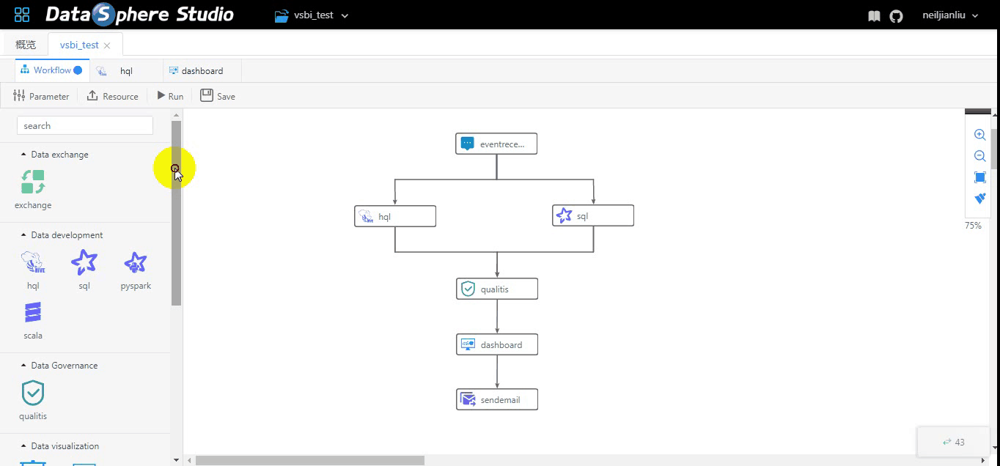
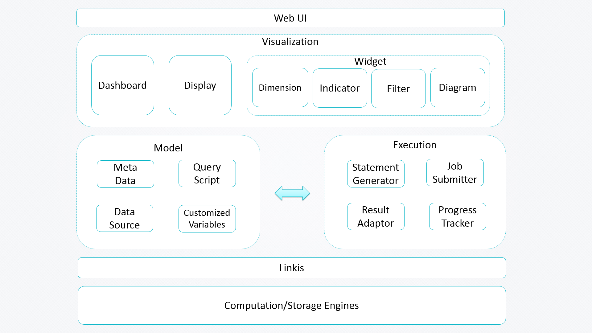

====

[English](README.md) | 中文

## 简介

Visualis是一个基于宜信的开源项目[Davinci](https://github.com/edp963/davinci)开发的数据可视化BI工具。现已被集成到数据应用开发门户[DataSphere Studio](https://github.com/WeBankFinTech/DataSphereStudio)中。

Visualis支持拖拽式报表定义、图表联动、钻取、全局筛选、多维分析、实时查询等数据开发探索的分析模式，并做了水印、数据质量校验等金融级增强。

## 功能特性

基于达芬奇项目, Visualis与DataSphere Studio结合，一同实现了以下特性：
* 图表水印
* 数据质量校验
* 图表展示优化
* 对接Linkis计算中间件
* Scriptis结果集一键可视化
* 外部应用参数支持
* Dashboard/Display集成为DataSphere Studio的工作流节点

Visualis同时支持以下Davinci的原生功能：
* **数据源**
  * 支持JDBC数据源
  * 支持CSV文件上传
* **数据视图**
  * 支持定义SQL模版
  * 支持SQL高亮显示
  * 支持SQL测试
  * 支持回写操作
* **可视组件**
  * 支持预定义图表
  * 支持控制器组件
  * 支持自由样式
* **交互能力**
  * 支持可视组件全屏显示
  * 支持可视组件本地控制器
  * 支持可视组件间过滤联动
  * 支持群控控制器可视组件
  * 支持可视组件本地高级过滤器
  * 支持大数据量展示分页和滑块
* **集成能力**
  * 支持可视组件CSV下载
  * 支持可视组件公共分享
  * 支持可视组件授权分享
  * 支持仪表板公共分享
  * 支持仪表板授权分享

## 与DataSphere Studio继承

Visualis与DataSphere Studio的数据开发、工作流调度和数据质量校验等模块无缝衔接，实现数据应用开发全流程的连贯顺滑用户体验。

更多信息请访问[DataSphere Studio documentations]().

 

## 架构设计

## 文档

[单独部署文档](visualis_docs/zh_CN/Visualis_deploy_doc_cn.md)

[快速对接DSS和Linkis](visualis_docs/zh_CN/Visualis_deploy_doc_cn.md)

[Visualis与Davinci的区别](visualis_docs/zh_CN/Visualis_Davinci_difference_cn.md)

## 交流贡献

## License

Visualis is under the Apache 2.0 license. See the [License](LICENSE) file for details.

