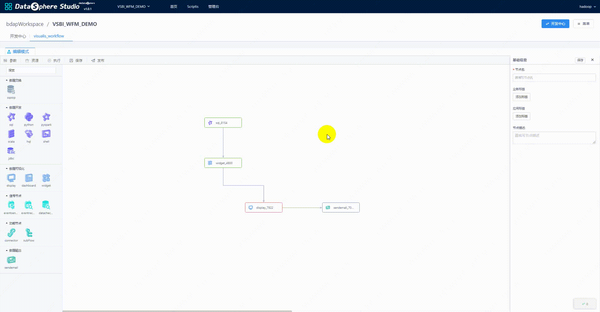

====

English | [中文](README-CH.md)

## Introduction

&nbsp;&nbsp;&nbsp;&nbsp;Visualis is an open source project based on Yixin [davinci](https://github.com/edp963/davinci) Developed data visualization Bi tool. It has been integrated into the data application development portal [datasphere studio](https://github.com/WeBankFinTech/DataSphereStudio) In this release, visualis1.0.0 supports linkis1.1.1 and dss1.1.0.  
&nbsp;&nbsp;&nbsp;&nbsp;Visualis provides data development/exploration functionalities including drag & drop style report definition, diagram correlation analysis, data drilling, global filtering, multi-dimensional analysis and real-time query, with the enhancement of report watermark and data quality management.

## Features

Based on Davinci project, Visualis achieves below features with DataSphere Studio:
* Add chart mark
* Data quality inspection
* Optimize chart display
* Linkis adaption for big-data queries
* One-click visualization from Scriptis
* External application parameters support
* View/Widget/Dashboard/Display as an appjoint of DataSphere Studio workflow

Visualis also supports most of the original features of Davinci v0.3.
* Data Source Support
  * Files in CSV format
  * JDBC data source
* Data View Support
  * Customized SQL template
  * SQL highlighting
  * SQL test
  * WriteBack mode
* Visual Components Support
  * Pre-defined charts
  * Controller components
  * Free Styles
* Interaction Support
  * Visual components displayed in full screen
  * Local controller for visual components
  * Filtering and cooperation among visual components
  * Group control for visual components
  * Local advanced filter for visual components
  * Paging mode and slider for huge volumes of data
* Integration Support
  * Download visual components in CSV format
  * Share visual components in a common/authorized way
  * Share dashboard in a common/authorized way

## DataSphere Studio Integration
Visualis seamlessly integrates with the data develoment, workflow scheduling and data quality management modules of DataSphere Studio, achieving a smooth and consistent user experience across the whole data application development lifecycle.

For more details: [Visualis User Manul Doc](./visualis_docs/en_US/Visualis_user_manul_en.md)

## Architecture design

## Documentation

## Install and deploy documentation
[Compile and deploy documentation](visualis_docs/en_US/Visualis_deploy_doc_en.md)

[AppConn Installation Documentation](visualis_docs/en_US/Visualis_appconn_install_en.md)

## User manual
[User documentation](visualis_docs/en_US/Visualis_user_manul_en.md)

[Difference Between Visualis and Davinci](visualis_docs/en_US/Visualis_Davinci_difference_en.md)

## Design documentation
[Visualis Design Documentation](visualis_docs/en_US/Visualis_design_en.md)

[Display and DashBoard preview principle](visualis_docs/en_US/Visualis_display_dashboard_privew_en.md)

[Visualis access to DSS/Linkis attention points](visualis_docs/en_US/Visualis_dss_integration_en.md)

[Integrate LinkisDatasource](visualis_docs/en_US/Visualis_linkisdatasource_en.md)

[How to send emails](visualis_docs/en_US/Visualis_sendemail_en.md)

[Principle of binding sql node](visualis_docs/en_US/Visualis_sql_databind_en.md)

[Virtual View Design Documentation](visualis_docs/en_US/Visualis_visual_doc_en.md)

## Upgrade documentation
[Upgrade Documentation](visualis_docs/en_US/visualis_update_en.md)

## License

DSS is under the Apache 2.0 license. See the [License](LICENSE) file for details.

