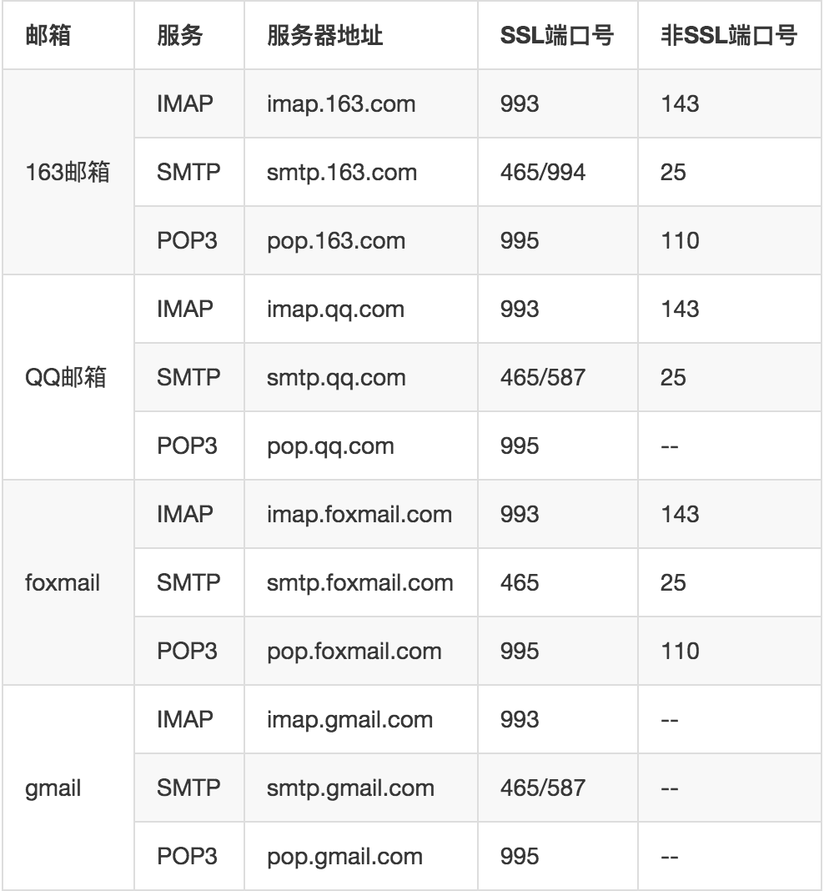

## 1 �境准备

- JDK 1.8（或更高版本�
- MySql5.5（或更高版本�
- Mail Server
- PhantomJs（安装请��：[phantomjs.org](http://phantomjs.org/)�
- Redis（�选）

## 2 �置部署

1. **�始化目录，将下载好� Davinci 包（Release 包，�是 Source 包）解�到�个系统目录，如：~/app/davinci**

   ```bash
   cd ~/app/davinci
   unzip davinci-assembly_3.0.1-0.3.0-SNAPSHOT-dist.zip
   ```

   解��目录结�如下图�示：

   

2. **�置�境��，将上述解��的目录�置到�境�� DAVINCI3_HOME**

   ```bash
   export DAVINCI3_HOME=~/app/davinci/davinci-assembly_3.0.1-0.3.0-SNAPSHOT-dist
   ```

3. **�始化数�库，修� bin 目录� initdb.sh 中�的数�库信�为��始化的数�库，� davinci0.3**

   ```bash
   mysql -P 3306 -h localhost -u root -proot davinci0.3 < $DAVINCI3_HOME/bin/davinci.sql
   ```

   �行脚本�始化数�库（注：由� Davinci0.3 系统数�库中包�存储过程，请务必在创建数�库时赋予执行��）�

   ```bash
   sh bin/initdb.sh
   ```

4. **�始化�置，Davinci0.3 的�置主�包括：server�datasource�mail�phantomjs�cache 等��**

   进入`config`目录，将`application.yml.example`�命�为`application.yml`
   å��开始é…�ç½®ã??

   ```bash
   cd config
   mv application.yml.example application.yml
   ```

   ***注：由�0.3版本使用 ymal 作为应用�置文件格�，请务必确��个�置项键�的冒�和�之间至少有�个空�***

   - **server �置**

     ```yml
     server:
       protocol: http
       address: 127.0.0.1
       port: 8080
     
       access:
         address: 192.168.1.1
         port: 80
     ```

     server �置如上示例�示，`server.access.address`和`server.access.port`表示真�访问地�和端�，默认�开�，其�默认为`server.address`和`server.port`�

     如你在虚拟主机上部署 Davinci，�动端�为`8080`，该主机真�访问IP地�为`192.168.1.1`，你将虚拟主机的`8080`端�映射到`80`端�，则�打开 access �置项，�则将�能正常使� Davinci 的部分功能，如激活账��下载�分享等�

   - **datasource �置**

     这里� datasource �置� Davinci 系统的数��，�置如下：

     ```yml
     spring:
       datasource:
     	url: jdbc:mysql://localhost:3306/davinci0.3?useUnicode=true&characterEncoding=UTF-8&zeroDateTimeBehavior=convertToNull&allowMultiQueries=true
         username: root
         password: root
         driver-class-name: com.mysql.jdbc.Driver
         initial-size: 2
         min-idle: 1
         max-wait: 60000
         max-active: 10
     ```

     将上�步�始化的数�库地��置到`url`中，url 中的�数���任何修改，然�修改正确的数�库访问用户和密��`username`和`password`�

     `initial-size`�`min-idle`�`max-wait`�`max-active`是��池�数，具体�性请��[DruidDataSource�置��列表](https://github.com/alibaba/druid/wiki/DruidDataSource%E9%85%8D%E7%BD%AE%E5%B1%9E%E6%80%A7%E5%88%97%E8%A1%A8)

   - **mail �置**

     ***注：0.3 版本用户采用注册�活的方�维护，所� mail �置是此版本必��少的，� mail �置出错�较高，请务必注�***

     ```yml
     spring:
       mail:
         host: smtp.****.com
         port: 25
         username: example@***.com
         password: example_password
         nickname: Davinci
         
         properties:
           smtp:
             starttls:
               enable: true
               required: true
             auth: true
           mail:
             smtp:
               ssl:
                 enable: false
                 
     ```

     mail �置并���，以上就是完整的 mail �置了，`username`为邮箱地�，`password`邮箱�务密�，需�注�的是常��费邮箱（� 163 邮箱�QQ 邮箱�gmail 等）这里应填客户端独立密�，���对应邮箱账�设置页��� SMTP �务，并申请客户端���（或独立密�，�邮箱�供商�法��）�

     下表为常��费邮� SMTP �务地��端�：

     

   - **phantomjs �置**

   phantomjs 是用�定时��报表截图的，����置安装好� phantomjs �执行文件地���，如�

   ```yml
   phantomjs_home: /usr/local/bin/phantomjs
   ```

   - **cache �置（�选）**

   cache 这里� redis 作为缓存�务，�置如下：

   ```yml
   spring:
   	redis:
   	  isEnable: false
   	  host: 127.0.0.1
   	  port: 6379
   	  
   	#  cluster:
   	#       nodes:
   	
   	  password:
   	  database: 0
   	  timeout: 1000
   	  jedis:
   	    pool:
   	      max-active: 8
   	      max-wait: 1
   	      max-idle: 8
   	      min-idle: 0
   ```

   如��开� cache �务，请将`isEnable`设为`true`，并�设置相关�置（�机方�请打�`host`和`port`，集群方�请打开`cluster`�置项，二��能�择��）�

   - **其他�置**

     日志�置文件为`config/logback.xml`，如当�的日志�置�能满足你的�求，�自定义�置日志模��

## 3 数����

Davinci0.3 �论上支�所有有 JDBC 的数��，我们默认支�的数��有�

| 数����    | 驱动�                                                |
| ------------- | ----------------------------------------------------- |
| mysql         | com.mysql.jdbc.Driver                                 |
| oracle        | oracle.jdbc.driver.OracleDriver                       |
| sqlserver     | com.microsoft.sqlserver.jdbc.SQLServerDriver          |
| h2            | org.h2.Driver                                         |
| phoenix       | org.apache.phoenix.jdbc.PhoenixDriver                 |
| mongodb       | mongodb.jdbc.MongoDriver                              |
| elasticSearch | --                                                    |
| presto        | com.facebook.presto.jdbc.PrestoDriver                 |
| moonbox       | moonbox.jdbc.MbDriver                                 |
| cassandra     | com.github.adejanovski.cassandra.jdbc.CassandraDriver |
| clickhouse    | ru.yandex.clickhouse.ClickHouseDriver                 |
| kylin         | org.apache.kylin.jdbc.Driver                          |
| vertica       | com.vertica.jdbc.Driver                               |
| hana          | com.sap.db.jdbc.Driver                                |
| impala        | com.cloudera.impala.jdbc41.Driver                     |

值得注�的是，Davinci 内部��供了 MySql 的驱动包，也就是说，如�你�使用其他数��，还需将对应驱动jar 包手动拷�到`lib`目录并�新�� Davinci �务；Davinci �� ElasticSearch 目�使用 [NLPchina�供的elasticsearch-sql](https://github.com/NLPchina/elasticsearch-sql)，系统内部默� ElasticSearch 版本为`5.3.2`，对应的 elasticsearch-sql 版本是`5.3.2.0`，��，如�你的 ElasticSearch �是`5.3.2`，首先需�你手动下载 NLPchina �供的对应版本的 jar，然�替��目�`lib`下的 jar，包括`elasticsearch-xxx.jar`�`transport-xxx.jar`�`x-pack-api-xxx.jar`�`
x-pack-transport-xxx.jar`�`elasticsearch-sql-XXX.jar`（`xxx`表示你的 ElasticSearch 版本�，`XXX`表示NLPchina 对应 elasticsearch-sql 版本�）�

�外值得注�的是，如�你的数���在以上列表中，也�以�过自定义�置注入数��，�则没必���，除�你知�在�什么：

- 打开自定义数���置文件

  ```bash
  mv datasource_driver.yml.example datasource_driver.yml
  ```

- 如下�置你的数��，这里� postgresql 为例

  ```yml
  postgresql:
     name: postgresql
     desc: postgresql
     driver: org.postgresql.Driver
     keyword_prefix:
     keyword_suffix:
     alias_prefix: \"
     alias_suffix: \"
  ```

  ***注�***

  - `keyword_prefix`和`keyword_suffix`表示关键字��和��，�设使� mysql 数�库，并将`desc`关键字作为字段使用，那么你的查询语�应该�:

    ```select `desc` from table```
    这里� ‘`� 就是���，它们必须�对被�置，�以都为空�

  - `alias_prefix`和`alias_suffix`表示别����，�� mysql 为例，�设你� sql 语�如下�

    ```select column as '�' from table```  

    这里ä¸? ‘columnâ€? 起了别å��为â?˜åˆ—’，那么â€?'’将作为å‰�å��ç¼?é…�置，å‰�å��缀必须æˆ�对被é…�置，å�¯ä»¥éƒ½ä¸ºç©ºã??

  - 对äº�以上别å��é…�置，你å�¯ä»¥ä½¿ç”¨`''`将字符包起æ�¥ï¼Œä¹Ÿå�¯ä»¥ä½¿ç”¨è½¬ç§»ç¬¦`\`，二者å�ªèƒ½å‡ºç�°ä¸€ç§�ã??

- 手动将相应的驱动 jar 包拷è´�到`lib`目录下ã??

- �� Davinci �务�