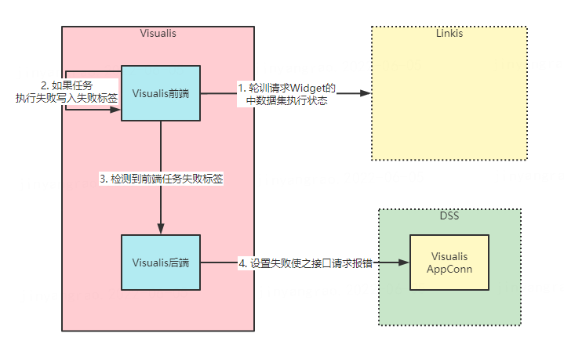

>Visualis display and dashboard preview mechanism

## 1. brief introduction
&nbsp;&nbsp;&nbsp;&nbsp;The preview mechanism of display and dashboard provides the function of previewing the mail to be sent. In use, you can click the preview button in the toolbar above the component after developing the display and dashboard. The viewer will create a new tab and open the preview page. When the page is fully opened, you can see the final picture effect. The following figure shows the final preview effect after the development of display, that is, the effect picture of sending the final mail report.


## 2. design principle
&nbsp;&nbsp;&nbsp;&nbsp;The visualis backend provides a preview interface, which is divided into two usage scenarios. The first is to support the front-end preview function of visualis, and the second is the interface for display and dashboard to call when docking DSS workflow. The request value is mainly the primary key ID of display and dashboard, and its return value is the output stream of the picture.

&nbsp;&nbsp;&nbsp;&nbsp;The display preview interface is similar to the dashboard preview interface. The preview interface of dashboard can view the previewportal method of the dashboardpreviewcontroller class in the source code, but the preview of dashboard has multiple panel pages and aggregates the pictures. Other logic is basically the same. The preview interface code of display:
```java
    @MethodLog
    @GetMapping(value = "/{id}/preview", produces = MediaType.IMAGE_PNG_VALUE)
    @ResponseBody
    public void previewDisplay(@PathVariable Long id,
                                        @RequestParam(required = false) String username,
                                        @CurrentUser User user,
                                        HttpServletRequest request,
                                        HttpServletResponse response) throws IOException {
        Display display = displayMapper.getById(id);
        Project project = projectMapper.getById(display.getProjectId());

        FileInputStream inputStream = null;
        try {
            List<ImageContent> imageFiles = scheduleService.getPreviewImage(user.getId(), "display", id);
            File imageFile = Iterables.getFirst(imageFiles, null).getImageFile();
            if(null != imageFile) {
                inputStream = new FileInputStream(imageFile);
                response.setContentType(MediaType.IMAGE_PNG_VALUE);
                IOUtils.copy(inputStream, response.getOutputStream());
            } else {
                log.error("Execute display failed, because image file is null.");
                response.sendError(504, "Execute display failed, because image file is null.");
            }
        } catch (Exception e) {
            log.error("display preview error: ", e);
        } finally {
            if(null != inputStream) {
                inputStream.close();
            }
        }
    }
```
&nbsp;&nbsp;&nbsp;&nbsp;The core of preview is to take screenshots of display pages and dashboard pages. Its main functions rely on the implementation of phantomjs. Visualis uses the selenium Library of Java to call phantomjs for screenshots. Its core logic is implemented in the screenshotutil class. The screenshot needs to rely on the binary file named phantomjs in the bin directory. This is the driver driver provided by selenium for phantomjs. Its related packages can be downloaded on Selenium's official website.
&nbsp;&nbsp;&nbsp;&nbsp;Since phantomjs is not maintained, it is possible to migrate to chrome in the future. You can also download the corresponding driver on the selenium official website. However, to use chrome, you need to install a real Chrome browser on the Linux machine. If you need to switch to chrome, you need to perform adaptation test and compatibility test.

## 3. Preview optimization
&nbsp;&nbsp;&nbsp;&nbsp;In the actual production and use, there will be an occasional case where the screenshot is wrong and the page is wrong. As a result, the report will occasionally appear as an error result when the e-mail is sent. This is a production problem in the usage scenario. In order to solve this problem, we introduce the failure tag monitoring mechanism, add * * widgetexecutefailedtag * * front-end tag elements in the front and back-end, and the back-end detects them.


