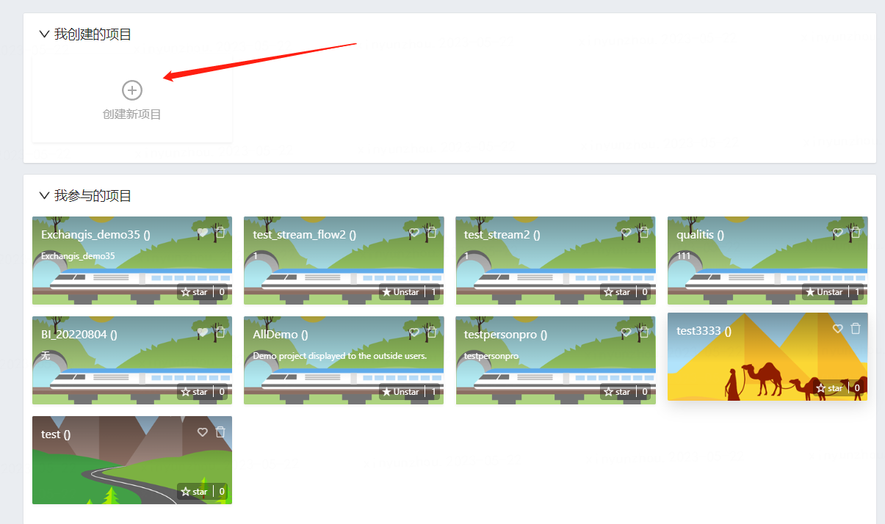
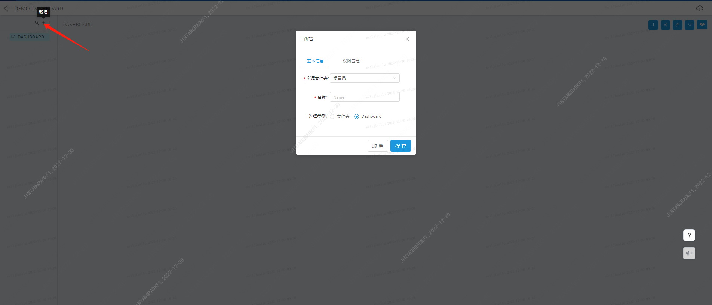

# Visualis working with documentation
## Service entrance
The visualis service is currently provided as a module of dataspherestudio. You can enter the DSS home page and then enter the service according to the following steps.
There are two ways to use visualis services:
1. If you need to edit Display and Dashboard for the purpose of sending emails, or have the need for project collaboration: enter the workspace, enter the workflow interface by creating a project, give relevant personnel editing and viewing permissions, and then [New Workflow], enter the workflow interface, drag and drop the Display, Dashboard and Widget nodes, save it, double-click the node to jump to the corresponding edit page.

2. If there is no need to send e-mail, create a service in visualis separately: enter the workspace, enter through [Top Left - All Products], and use the same usage habits as in DSS. Note: The project, display, and dashboard created from this portal cannot be referenced by the workflow, so only the view and widget are supported.

## First app
Let's implement the first application first, if you can't do it in one step, don't worry, you'll find the corresponding introduction in the following chapters.

1. Log in to DataSphereStudio
   The Visualis service is currently provided as a module of DataSphereStudio, and to use Visualis you first need to log in to Visualis.

2. Enter the Visualis module
   Enter the DSS workspace and enter through [Upper left corner - All Products]. Click the Favorites button, click the Pin button in the left navigation bar, fix Visualis in the upper navigation bar of DSS, and then enter directly from the upper navigation bar.

3. Create a project
   Once in Visualis, click Create New Project.

4. Create a data source

5. Create a data view

After the data view is created successfully, start creating the chart component.

Select the data view you just created in the upper left corner, load the list of data model fields, and simply drag and drop a sub-type field to the "Dimension" of the "Data" tab and a "Numeric" field to the "Metric" area of the "Data" tab, and select a chart type.

Save the visualization component.

6. Create a visualization app
   After the visualization component is created, start creating the visualization application and click the "Create New Dashboard" button to create a dashboard portal.

After the dashboard portal is created, click Enter to create a dashboard in the left menu:

After the dashboard is created, click the "+" button in the upper-left corner of the dashboard to add the visualization component you just created.

After clicking Save, you will be able to see the visualization component you just created on the dashboard.

Drag the lower right corner of the visualization component to adjust the size slightly, and the first visualization application is successfully created!

## Function overview
### Project / engineering module
There are two ways to create a project:
1. In the workflow module of DSS, create a new project, and visualis will synchronously create a new project with the same name.
2. Create a project through the native functionality of the visualis home page:

### Basic function module
1.	View view: View is a structured form of data, and all logic/permissions/services are expanded from View. It is used to manage user-written SQL templates and configure the data model and row and column permissions obtained after SQL execution. The data for the data view is obtained from the source.
2.	Widget component: Widget is the visual form of data, and all display/interaction/guidance, etc. are expanded from Widget. A widget is the smallest unit of a visual application. According to the data model provided by the View, the SQL results are grouped for secondary aggregation, and then the secondary processed data is visually encoded.
3.	Viz visualization: Visualis provides two visual application components: dashboard and large-screen display. Dashboard: Visualis provides a visual application that provides automatic layout and interactive capabilities to help users quickly create visual reports. Display is the second visualization application provided by Visualis, which uses visualization components and a series of built-in auxiliary graphics to create a visually rich visual screen.
## data source
1.	Hive data source, which does not need to be added manually, has been loaded by default.
2.	You can add other JDBC data sources manually.
## view
### Add view
1. Access the view list from the left menu bar and click the Add button in the upper right corner:
   
2. Click a source in the upper left corner and select the corresponding data source (if it is a hive data source, select hivedatasource). After writing SQL in the edit box, click the execute interface in the lower right corner to pre execute.
3. After execution, you can preview the execution results on the result set page below.
   
4. On the result set page, you can adjust the field type information after switching the tab to the model. (if you want to use a Chinese field name, you can use the select as statement to convert the field to Chinese.)
5. After editing, you can name the view in the upper left corner and click the Save button in the upper right corner to save the view.
   
## Chart component
### Create chart
1. Enter the widget component list from the left menu bar and select the Add button at the top right.

2. Enter the chart editing interface. From left to right, the interface includes view field bar, chart configuration bar and chart display area. After selecting a view in the upper left corner, you can see that all fields in the view are listed in the view field column on the left.
 

3. Drag the fields in the field column into the indicators and dimensions in the configuration column to edit and preview the chart. Type fields can be dragged into dimensions, and numerical fields can be dragged into indicators. If you find that there is an error in the division of numeric type and sub type of a field, you can also drag the field directly up and down to the column of another type, so as to directly change the field type.
4. After clicking an indicator, you can switch the aggregation method of the indicator in the drop-down menu (sum by default).

5. After previewing the data in the display area, you can switch the display type of the chart in the configuration area. When you hover over the thumbnail icon, you can see the number of indicator dimensions that the chart type needs to meet. After adjusting according to the prompts, you can complete the editing of the chart.
6. Chart display supports two driving modes, a) perspective driving: in this mode, a chart will be generated for each indicator separately; b) Chart driven: in this mode, all data are displayed in the same chart, but the data must be within the limits of the chart. The two modes can be switched in the area shown in the following figure.
7. After editing the chart, enter the chart component name in the upper left corner and click save in the upper right corner.

### Filtering and sorting
1. It supports dragging any field into the filter box in the configuration bar to further filter the chart results.

2. After dragging, a selection window will appear in the interface, showing all the values of the current field. Check the required value and click save.
3. If there are more complex filtering requirements, you can switch to conditional filtering and customize personalized filtering.

4. click dimension or indicator to select sorting:
5. Note that after configuring the filter sorting options, you must click the Save button in the upper right corner to save. Otherwise, if you exit and enter again, the last configuration will not be retained.
### Chart styles and adjustments
1. In some chart types, the values of each dimension can be displayed in different colors. As shown in the following figure, drag the field into the color box. In the pop-up window, assign different colors to each value and save.

2. You can adjust the appearance of elements such as font, color, label and coordinate axis through the style bar. The optional items of each chart are different.

3. The style adjustment also needs to be saved through the Save button in the upper right corner.
## Visual presentation
### Two display forms
1.	Visualis supports dashboard and display. You can select the visualization bar in the left menu bar to enter the selection interface.
2.	Among them, the charts of dashboard are organized on the screen in a more orderly and unified form, and provide advanced functions such as chart linkage and global filtering.
3.	The display editor has a higher degree of freedom, and supports common typesetting options such as background color, layer order, custom labels, etc., making it easy to customize a large visual screen with more artistic personality.
### DashBoard
1. Click Add dashboard, enter the name, and click Save to find the newly added dashboard in the list.
2. Click the icon to enter the editing interface. In the editing interface, you can create a multi-level directory structure and add sub dashboards to the directory to classify dashboards with different logic.

3. In the sub dashboard, click the Add icon in the upper right corner to select the widget chart component we created earlier and add it to the screen.
4. In step 2, you can configure the refresh interval of report data. The default is manual refresh. You can adjust it to automatic refresh in seconds.
5. Click Save to see that the selected chart has been added to the screen. At this point, you can drag to adjust the size and position of the chart.
6. All operations in the dashboard editing interface will be saved automatically without additional operations.
### Display
1. Click Add display, enter the name, and click Save to find the newly added display in the list.
2. Click the icon to enter the editing interface. In the right column, some basic customization operations for the entire display are supported.
3. Click the chart button in the upper menu bar to select the widget component to add.
4. Click the widget button in the upper menu bar to add some auxiliary widgets. Such as text label, current time, etc.
5. By dragging, you can adjust the position, zoom in and out, etc. of charts and components. If you feel the screen is too small, you can adjust the display scale in the lower right corner of the canvas.
6. Directly click a chart in the canvas, or check a layer in the layer on the right (each chart or widget constitutes a separate layer) to configure the layer independently.

7. For text labels, you can enter text in the configuration bar on the right.
### Sharing and authorization
1. It supports sharing a dashboard, a display or a widget to a third party through links. Note: when opening the sharing link, the third party must have logged in to DSS.

2. In addition to ordinary sharing, visualis also supports authorized sharing for specified users. Only authorized users log in and open the link can see the chart content.

