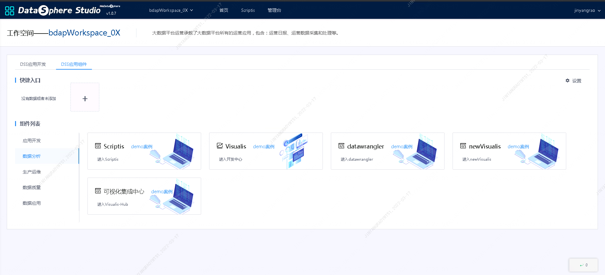
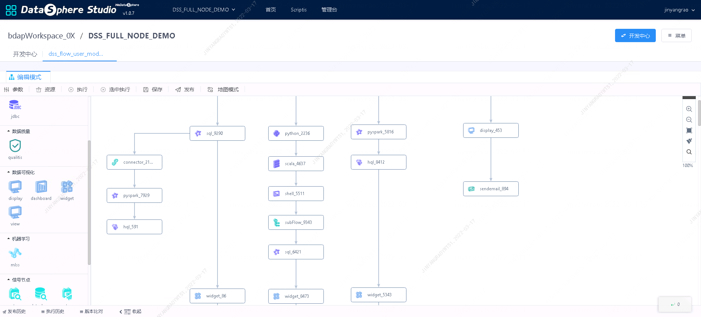
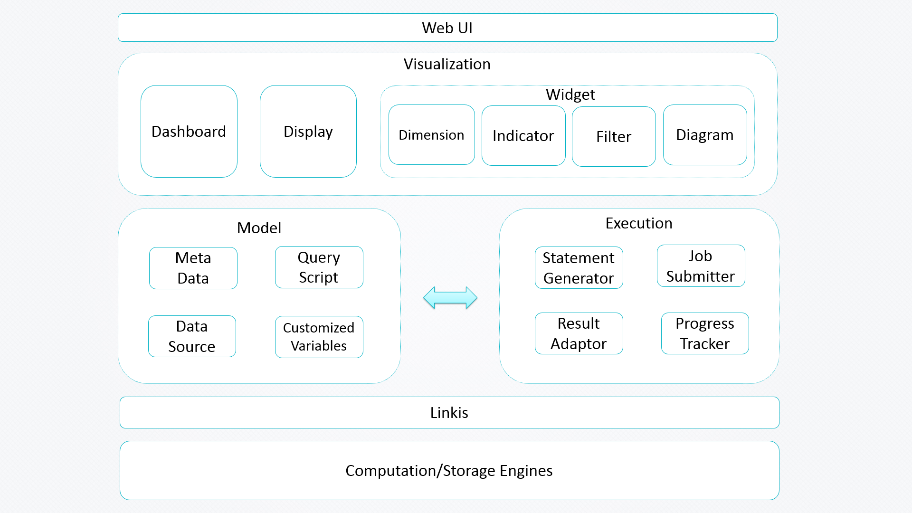

# 1. Functional characteristics
&nbsp;&nbsp;&nbsp;&nbsp;Based on the DaVinci project, visualis and datasphere studio are combined to realize the following features:
- Chart watermark
- Data quality verification
- Chart presentation optimization
- Interface with the linkis computing middleware
- Scriptis result set one click visualization
- External application parameter support
- Dashboard/display set becomes workflow node of datasphere studio
- Visualis also supports the following native features of DaVinci: data sources
- Supports JDBC data sources
- Supports uploading CSV files
- Data view
- Supports defining SQL templates
- Support SQL highlighting
- Support SQL testing
- Support write back operation
- Visual components
- Supports predefined charts
- Support controller components
- Supports free styles
- Interaction capability
- Support full screen display of visual components
- Support visual component local controller
- Support filtering linkage between visual components
- Support group control controller visual components
- Support visual component local advanced filters
- Support large data display paging and slider
- Integration capability
- Supports CSV downloading of visual components
- Support public sharing of visual components
- Support visual component authorization sharing
- Support dashboard public sharing
- Support dashboard authorization sharing
# 2. Integration with DSS
&nbsp;&nbsp;&nbsp;&nbsp;Visualis is a data visualization platform solution that provides a one-stop data visualization solution for business personnel, data engineers, data analysts, and data related positions. Users can simply configure different data sources on the front end of the visualization page, realize a set of data visualization applications, support the display of multiple data models, and provide visualization functions such as advanced interaction, industry analysis, pattern exploration, social intelligence, etc. Visualis is seamlessly connected with the data development, workflow scheduling, data quality verification and other modules of datasphere studio to achieve a coherent and smooth user experience in the whole process of data application development.

## 2.1. App store integration

&nbsp;&nbsp;&nbsp;&nbsp;Visualis implements the first level specification of DSS, connects to the application store of DSS, supports switching from DSS to visualis, and implements SSO specification, which allows secret free interworking.

## 2.2. Workflow integration

&nbsp;&nbsp;&nbsp;&nbsp;Visualis implements the secondary and tertiary specifications of DSS, accesses DSS engineering and orchestration (workflow), configures the workflow nodes of DSS, and supports the use of visualis by dragging and dropping in DSS workflow.

3.1. architecture design

&nbsp;&nbsp;&nbsp;&nbsp;It is designed around the two core concepts of view (data view) and widget (visual component). View is a structured form of data, and all logic / permissions / services are expanded from view (as a virtual view in the spark SQL node of DSS workflow). A widget is a visual form of data. All display / interaction / guidance, etc. are carried out from the widget. The following figure shows the functional component modules of visualis.

