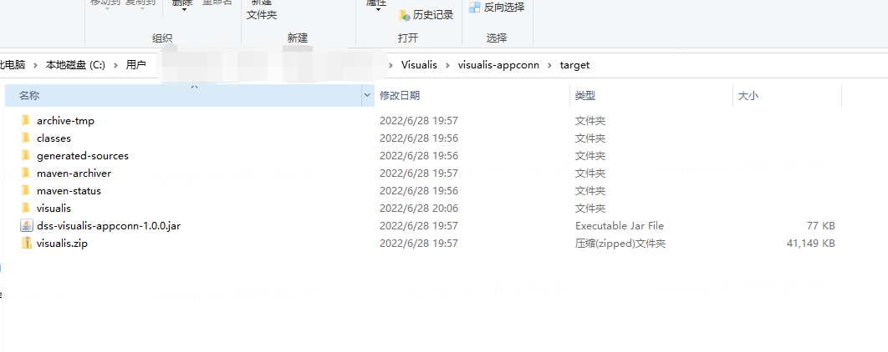

> Visualis AppConn安装

## 1. AppConn安装
&nbsp;&nbsp;&nbsp;&nbsp;DSS1.1.0的第三方组件AppConn归属于第三方组件自己维护，所以为了成功安装visualis，并支持DSS工作流，需要拉取visualis1.0.0代码，编译打包AppConn代码。  
```shell
# 进入visualis源码项目中
cd visualis

# 进入visualis-appconn模块
cd visualis-appconn

mvn clean package -DskipTests=ture
```
&nbsp;&nbsp;&nbsp;&nbsp;如下图visualis.zip包即为visualis-appconn的包。



&nbsp;&nbsp;&nbsp;&nbsp;如果是使用[DSS一键安装全家桶](https://github.com/WeBankFinTech/DataSphereStudio-Doc/blob/1.1.0/zh_CN/%E5%AE%89%E8%A3%85%E9%83%A8%E7%BD%B2/DSS%26Linkis%E4%B8%80%E9%94%AE%E9%83%A8%E7%BD%B2%E6%96%87%E6%A1%A3%E5%8D%95%E6%9C%BA%E7%89%88.md)来部署的服务，可以直接使用其软件包中提供的脚本工具。在一键全家桶部署完成后，可以在dss的安装目录下找到脚本工具，其目录结构和使用说明如下。
```shell
# 进入到dss安装的bin目录下
>> cd dss/bin

# 其中appconn-install.sh就是AppConn安装脚本工具
>> ls
>> appconn-install.sh  appconn-refresh.sh  checkEnv.sh  executeSQL.sh  install.sh  start-default-appconn.sh
```
&nbsp;&nbsp;&nbsp;&nbsp;为了能够安装顺利，首先需要部署完成Visualis服务，然后需要把visualis appconn的zip包放置到规定的appconn目录解压。Visualis的安装部署可以参考[Visualis安装部署文档](./Visualis_deploy_doc_cn.md)，visualis appconn zip包放置和AppConn安装脚本工具步骤如下：
```shell
# 把visualis appconn放置到dss-appconns目录下
rz -ybe ${DSS_INSTALL_HOME}/dss/dss-appconns

# 解压Visualis AppConn包
unzip visualis.zip

cd {DSS_INSTALL_HOME}/dss/bin

>> sh appconn-install.sh

# 输入Visualis名称
>> visualis

# 输入Visualis前端IP地址
>> 127.0.0.1

# 输入Visualis服务的前端端口后
>> 8088

# 在执行AppConn安装脚本工具后，会插入相关第三方AppConn的配置信息
```
&nbsp;&nbsp;&nbsp;&nbsp;修改完成后需要重启DSS服务。
&nbsp;&nbsp;&nbsp;&nbsp;如果是域名的方式访问DSS服务，需要参考[visualis安装部署文档](./Visualis_deploy_doc_cn.md)的第5小节。
