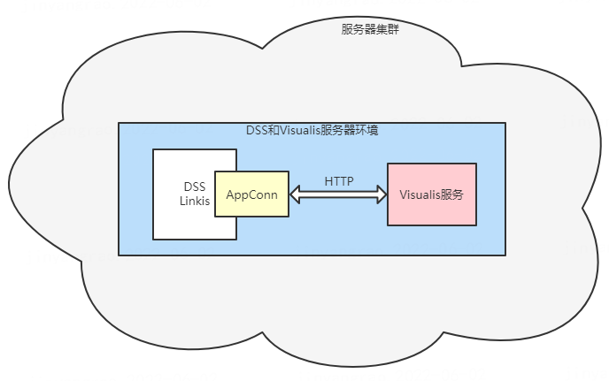
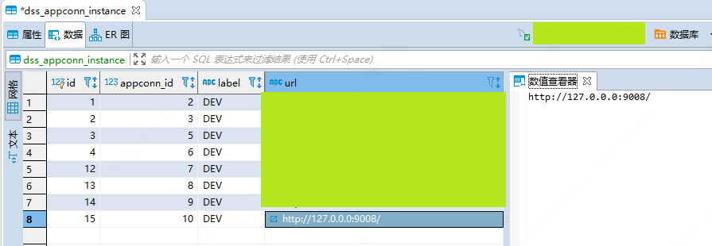

> Visualis AppConn安装

## 1. 简介
&nbsp;&nbsp;&nbsp;&nbsp;Visualis是基于开源项目Davinci二次开发的一个数据可视化系统，为了实现与DSS打通，Visualis实现了DSS AppConn接入的相关规范，对于App Conn接入规范可以参考[DSS AppConn接入规范](https://github.com/WeBankFinTech/DataSphereStudio-Doc/blob/main/zh_CN/%E5%AE%89%E8%A3%85%E9%83%A8%E7%BD%B2/VisualisAppConn%E6%8F%92%E4%BB%B6%E5%AE%89%E8%A3%85%E6%96%87%E6%A1%A3.md)，Visualis作为数据可视化节点接入DSS，其需要满足三级规范，即：  
* 为了实现与DSS免密互通，实现了SSO规范
* 为了实现与DSS工程打通，实现了组织结构规范
* 为了实现与DSS工作流开发互通，实现了应用开发规范  

&nbsp;&nbsp;&nbsp;&nbsp;AppConn是运行在其DSS和Linkis内部的一个JVM进程，对于每一个接入进来的第三方应用都存在一个其独有的AppConn实例，其作用类似于一个第三方应用在DSS中的一个代理客户端，如果DSS需要使用与第三方系统的交互，可调用相关的AppConn，在AppConn中去请求第三方应用，来实现交互，可以通过下图可以直接的了解AppConn的作用。  


&nbsp;&nbsp;&nbsp;&nbsp;为了在DSS工作流中使用Visualis的相关功能，所以需要安装相应的AppConn，以便在DSS工作流中开发Visualis可视化报表。

## 2. 一键安装包安装
&nbsp;&nbsp;&nbsp;&nbsp;如果是使用[DSS一键安装全家桶]()来部署的服务，可以直接使用其软件包中提供的脚本工具。在一键全家桶部署完成后，可以在dss的安装目录下找到脚本工具，其目录结构和使用说明如下。
```shell
# 进入到dss安装的bin目录下
>> cd dss/bin

# 其中appconn-install.sh就是AppConn安装脚本工具
>> ls
>> appconn-install.sh  checkEnv.sh  excecuteSQL.sh  install.sh
```
&nbsp;&nbsp;&nbsp;&nbsp;为了能够安装顺利，首先我们需要部署和启动Visualis服务。Visualis的安装部署可以参考[Visualis安装部署文档]()，使用AppConn安装脚本工具时步骤如下：
```shell
>> sh appconn-install.sh

# 选择安装Visualis AppConn
>> 1

# 输入Visualis部署的服务器IP
>> 127.0.0.1

# 输入Visualis服务的端口号
>> 8008

# 在执行AppConn安装脚本工具后，会插入相关第三方AppConn的配置信息
```
&nbsp;&nbsp;&nbsp;&nbsp;**需要额外注意，由于linkis-gateway支持多活服务请求转发，会通过名称进行匹配转发，在实际使用过程中，如果需要走前端接口去请求服务，需要在求中配置相应的标签，使得请求转发成功，由于DSS1.0.1的Visualis AppConn去请求Visualis服务时，暂未加上标签，会导致请求被拦截，所以DSS1.0.1版本中，需要手动修改dss_appconn_instance表的url字段，使Visualis AppConn请求走服务端请求路径，来支持DSS工作流和Visualis服务的交互（下个版本我们会修复这个问题）。相关表修改记录参考如下：**

```sql
-- 1. 找到visualis appconn instance
-- 通过AppConn来找到instance
-- 即visualis的appconn表中id为10，appconn_instance表中id为15则为visualis的配置

-- ${ip}: 服务端IP
-- ${port}: 服务端端口
update dss_appconn_instance set url 'http://${ip}:${port}/' where appconn_id = 10;
```


## 3. 独立安装
&nbsp;&nbsp;&nbsp;&nbsp;如果是独立部署的DSS和Linkis服务，需要额外的新增Visualis来使用，可以选择独立安装AppConn。下载DSS一键安装全家桶，解压后，在dss/bin中找到appconn-install.sh脚本，把该脚本放置在安装完成的DSS路径下的bin目录下(需要确保源码编译安装的DSS其AppConn的包也是完好的)。
```shell
# 复制解压后的一键安装全家桶appconn安装脚本工具到安装的DSS bin目录下
>> cp appconn-install.sh /appconn/Install/DSSInstall/bin/

# 执行该脚本
>> sh appconn-install.sh

# 类似于第2步中的步骤
...

```
&nbsp;&nbsp;&nbsp;&nbsp;当然如果需要更加灵活的安装方式，可以单独执行Visualis AppConn的相关SQL，其中涉及的表如下，可参考如下表，如果在安装时，请注意需要，由于篇幅有限，DSS插入表的相关SQL可以在一键全家桶中找到在DSS AppConn lib包下的Visualis的init.sql，该SQL脚本存在一些变量，需替换后进行插入。

|表名|作用|备注|
|-----|-----|-----|
|dss_application|DSS快捷应用商店配置|需要配置Visualis的工程前端访问地址|
|dss_menu|DSS快捷应用商店|配置应用商店的各个分类信息|
|dss_onestop_menu_application|应用的菜单表|配置Visualis应用所属菜单|
|dss_appconn|DSS AppConn配置表|AppConn的相关配置信息|
|dss_appconn_instance|AppConn实例信息表|配置各个AppConn实例相关信息|
|dss_workflow_node|工作流节点配置表|配置需加入DSS工作流的相关节点配置|
|dss_workflow_node_to_ui|工作流各节点所需配置表|配置各个节点在DSS中需要的配置项|