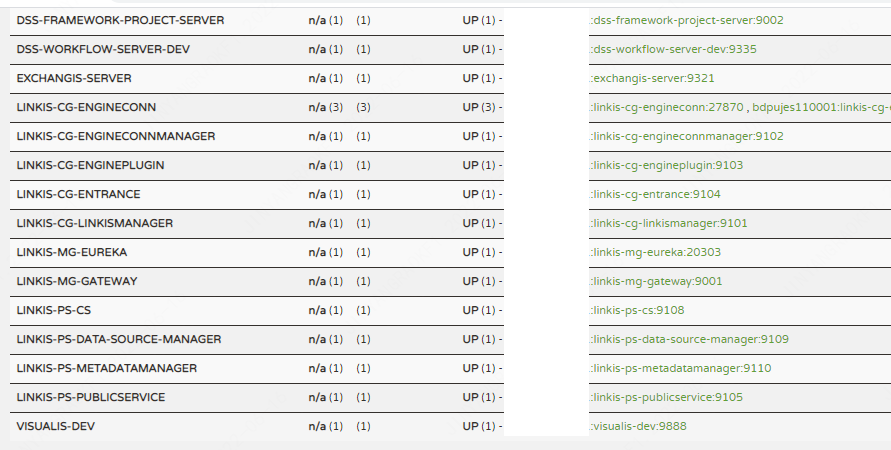

Visualis编译部署文档
------

# 1. 环境准备及编译

## 1.1. 依赖环境准备
| 依赖的组件                                 | 是否必装 | 安装直通车 |
|---------------------------------------| ------ | --------------- |
| MySQL (5.5+)                          | 必装  | [如何安装mysql](https://www.runoob.com/mysql/mysql-install.html) |
| JDK (1.8.0_141)                       | 必装 | [如何安装JDK](https://www.runoob.com/java/java-environment-setup.html) |
| Hadoop(2.7.2，Hadoop 其他版本需自行编译 Linkis) | 必装 | [Hadoop单机部署](https://linkis.apache.org/zh-CN/docs/latest/deployment/quick_deploy) ；[Hadoop分布式部署](https://linkis.apache.org/zh-CN/docs/latest/deployment/quick_deploy) |
| Spark(2.4.3，Spark 其他版本需自行编译 Linkis)   | 必装 | [Spark快速安装](https://linkis.apache.org/zh-CN/docs/latest/deployment/quick_deploy) |
| DSS1.1.1                              | 必装 | [如何安装DSS](https://github.com/WeBankFinTech/DataSphereStudio-Doc/blob/1.1.0/zh_CN/%E5%AE%89%E8%A3%85%E9%83%A8%E7%BD%B2/DSS%26Linkis%E4%B8%80%E9%94%AE%E9%83%A8%E7%BD%B2%E6%96%87%E6%A1%A3%E5%8D%95%E6%9C%BA%E7%89%88.md) |
| Linkis1.3.2（大于等于该版本）                  | 必装 | [如何安装Linkis](https://linkis.apache.org/zh-CN/docs/latest/deployment/quick_deploy) |
| Nginx                                 | 必装 | [如何安装 Nginx](http://nginx.org/en/linux_packages.html) |

## 1.2. 创建 Linux 用户

&nbsp;&nbsp;&nbsp;&nbsp;请保持Visualis的部署用户与Linkis的部署用户一致，采用hadoop用户部署。

## 1.3. 底层依赖组件检查
&nbsp;&nbsp;&nbsp;&nbsp;**在安装linkis后，请确保DSS1.1.1与Linkis1.3.2 基本可用，可在 DSS 前端界面执行 SparkQL 脚本，可正常创建并执行 DSS 工作流。**

## 1.4. 下载源码包及编译后端
&nbsp;&nbsp;&nbsp;&nbsp;Visualis源码安装时，需要下载对应的源码包进行编译，目前Visualis在依赖的Linkis1.3.2、DSS1.1.1版本已经上传到Maven中央仓库，只需Maven配置正常即可拉取相关依赖.

```shell
# 1. 下载源码
git clone https://github.com/WeBankFinTech/Visualis.git

# 2. 切换到1.0.1分支
git checkout 1.0.1

# 3. 执行编译打包
cd Visualis
mvn -N install
mvn clean package -DskipTests=true
```

## 1.5. 编译前端
&nbsp;&nbsp;&nbsp;&nbsp;Visualis是一个前后端分离项目，前端文件可以单独编译打包，在电脑上需要安装npm工具，可以查看[npm安装](https://nodejs.org/en/download/)，在windowns机器上，可以打开Idea工具的Terminal界面，或者使用Git bash完成前端编译。
```shell
# 查看npm是否安装完成
npm -v
>> 8.1.0

cd webapp # 进入前端文件路径
npm i # 下载前端依赖
npm run build # 编译前端包

# 在webapp目录下会生成一个build文件目录，该目录即编译完成的前端包文件

# 在windows环境，压缩build目录为一个zip文件即可
```

## 2. 安装部署
## 2.1. 安装后端
&nbsp;&nbsp;&nbsp;&nbsp;Visualis使用assembly作为打包插件，在编译完成后，进入到Visualis/assembly/target目录下，可以找到编译完成后的visualis-server.zip包。
````bash
# 1. 解压安装包
unzip visualis-server.zip
cd visualis-server
````
&nbsp;&nbsp;&nbsp;&nbsp;解压完成visualis编译包后，进入目录可以看到以下文件目录。
```
visualis-server
    --- bin   # 服务启停脚本
    --- conf  # 服务配置目录
    --- davinvi-ui    # 前端模板，有无并不影响使用
    --- lib   # 服务jar包存放位置
    --- logs  # 日志目录
```
&nbsp;&nbsp;&nbsp;&nbsp;在需要部署的服务器上（也可以是DSS部署的服务器），上传该visualis-server.zip包，在需要部署的路径上，解压即可完成Visualis安装。

## 2.2. 初始化数据库
&nbsp;&nbsp;&nbsp;&nbsp;Visualis的编译包，解压即为安装，并未去执行相关的SQL文件，所以在正常安装步骤中，需要建立一个visualis的数据库，并执行visualis的相关建表语句。
&nbsp;&nbsp;&nbsp;&nbsp;相关建表语句可以在源码中找到，进入到源码的根目录，找到db文件夹，连接到对应的数据库后，执行以下SQL文件，建立Visualis使用时需用到的表。
```shell
# 在源码包db目录中找到对应的sql文件

# 连接visualis数据库
mysql -h 127.0.0.1 -u hadoop -d visualis -P3306 -p

source ${visualis_home}/davinci.sql
source ${visualis_home}/ddl.sql

# 其中davinci.sql是visualis需要使用到的davinci的表
# ddl.sql是visualis额外依赖的表
```


## 2.3. 字体库安装
&nbsp;&nbsp;&nbsp;&nbsp;对于邮件报表而言，需要渲染中文字体，其中Visualis截图功能依赖中文字体，在部署的机器上/usr/share/fonts目录下。新建一个visualis文件夹，上传**Visualis源码包中ext目录下的pf.ttf到该visualis文件夹下**，执行fc-cache –fv命令刷新字体缓存即可。
```shell
# 需要切换到root用户
sudo su
cd /usr/share/fonts
mkdir visualis

# 上传pf.ttf中文字体库
rz -ybe

# 刷新字体库缓存
fc-cache –fv
```
&nbsp;&nbsp;&nbsp;&nbsp;在使用visualis时，调用预览功能或在工作流中执行Display和Dashboard时，如果提示报错：**error while loading shared libraries: libfontconfig.so.1: cannot open shared object file: No such file or directory**，是由于部署visualis的机器缺少相关依赖导致报错，执行**sudo yum -y install fontconfig-devel**安装依赖。


## 2.4 安装前端

&nbsp;&nbsp;&nbsp;&nbsp;为了更好的说明前端配置，首先给出nginx的配置，visualis的nginx的前端配置和说明：
```shell
server {
    
    listen  8088;# a. 访问端口
    server_name  localhost;

  location /dss/linkis { # b. linkis管理台的静态文件目录
    root   /data/dss_linkis/web;
    autoindex on;
  }
  
  location /dss/visualis { # c. 前端访问路径，需要手动创建
    root   /data/dss_linkis/web; # d. visualis前端静态资源文件目录，可自由指定
    autoindex off;
  }

  location / { # e. dss静态文件目录
    root   /data/dss_linkis/web/dist;
    index  index.html index.html;
  }

  location /ws {
    proxy_pass http://127.0.0.1:9001; # f. linkis gateway地址
    # ...
  }

  location /api {
    proxy_pass http://127.0.0.1:9001; # g. linkis gateway地址
    # ...
  }
}
```
&nbsp;&nbsp;&nbsp;&nbsp;Visualis当前使用前后端分离的部署方案，即前后端分别打包部署，完成前端编译后，把前端包（前端资源文件）放置在nginx配置的前端资源文件目录下 **（即上述配置 c和d小项）。**
```shell
# 配置静态资源根路径（用于配置nginx的root参数，即d小项）
cd /data/dss_linkis/web

# 在上一步/data/dss_linkis/web目录下，配置前端访问url路径地址（即c小项，没有则需要创建）
cd dss/visualis

# 上传Visualis前端包
rz -ybe build.zip

unzip build.zip # 解压前端包

cd build # 进入到解压路径

mv * ./../ # 把静态资源文件移动到c小项dss/visualis路径下
```
&nbsp;&nbsp;&nbsp;&nbsp;前端部署配置后，可以重启nginx或者刷新nginx配置使得上述配置生效**sudo nginx -s reload。**


## 2.5. 修改配置

### 2.5.1. 修改application.yml
&nbsp;&nbsp;&nbsp;&nbsp;在配置application.yml文件中，必须要配置的有1、2、3配置项，其它配置可采用默认值，其中第1项中，需要配置一些部署IP和端口信息，第2项需要配置eureka的信息，第3项中只需要配置数据库的链接信息。**（visualis的库可以和dss同库，也可以不同，需部署用户自行抉择）**。
```yaml
# ##################################
# 1. Visualis Service configuration
# ##################################
server:
  protocol: http
  address: 127.0.0.1 # server ip address（服务部署的机器IP）
  port:  8008 # server port（visualis服务进程端口）
  url: http://127.0.0.1:8088/dss/visualis # frontend index page full path（前端访问visualis的完整路径）
  access:
    address: 127.0.0.1 # frontend address（前端部署IP）
    port: 8088 # frontend port（前端访问端口）


# ##################################
# 2. eureka configuration
# ##################################
eureka:
  client:
    serviceUrl:
      defaultZone: http://127.0.0.1:20303/eureka/ # Configuration required
  instance:
    metadata-map:
      test: wedatasphere
management:
  endpoints:
    web:
      exposure:
        include: refresh,info


# ##################################
# 3. Spring configuration
# ##################################
spring:
  main:
    allow-bean-definition-overriding: true
  application:
    name: visualis-dev
  datasource:
    url: jdbc:mysql://127.0.0.1:3306/visualis?characterEncoding=UTF-8&allowMultiQueries=true # Configuration required
    username: hadoop
    password: hadoop

# 其它参数保持默认，如果不需要定制化修改，采用默认参数即可
```

### 2.5.2. 修改linkis.properties
&nbsp;&nbsp;&nbsp;&nbsp;**注意事项：该配置需与linkis gateway的ip与端口号配置保持一致**
```properties
# ##################################
# 1. need configuration
#    需要配置
# ##################################
wds.linkis.gateway.url=http://127.0.0.1:9001

# 其它可以使用默认参数
# 省略配置
```
&nbsp;&nbsp;&nbsp;&nbsp;**如果部署的hadoop集群开启了Kerberos，需要在visualis的配置文件linkis.properties文件中开启Kerberos，加入配置项：**
```properties
wds.linkis.keytab.enable=true
```

## 3. 启动应用

&nbsp;&nbsp;&nbsp;&nbsp;在配置和前端包编译完成后，可以尝试启动服务。Visualis目前和DSS集成，使用了DSS的登录及权限体系，使用前需部署完成DSS1.1.1版本，可以参考DSS1.1.1一键安装部署。

### 3.1. 执行启动脚本

&nbsp;&nbsp;&nbsp;&nbsp;进入Visualis的安装目录，找到bin文件夹，在此文件夹下执行一下命令。
```
sh ./start-visualis-server.sh
```
备注：**如果启动服务时，报启动脚本的换行符无法识别，需要在服务器上对脚本进行编码转换使用：dos2unix xxx.sh 命令进行转换**

### 3.2. 确认应用启动成功

&nbsp;&nbsp;&nbsp;&nbsp;打开Eureka页面，在注册的服务列表中，找到visualis服务的实例，即可认为服务启动成功。同时也可以查看visualis的服务启动日志，如果没有报错，即服务顺利启动。
```
# 查看服务启动日志
less logs/linkis.out
```
&nbsp;&nbsp;&nbsp;&nbsp;查看Eureka页面，查看服务是否注册成功。


## 4. AppConn安装
&nbsp;&nbsp;&nbsp;&nbsp;Visualis服务部署后，需要和DSS应用商店和工作流打通，需要在DSS侧安装对应的AppConn，可参考[VisualisAppConn安装](./Visualis_appconn_install_cn.md)。

## 5. 有关域名访问DSS时Visualis的配置说明（可选）
&nbsp;&nbsp;&nbsp;&nbsp;在实际生产中，访问DSS一般使用域名进行访问，读者阅读visualis安装部署文档和appconn的部署文档时会发现，visualis的配置中出现几处前端配置，这些前端配置影响预览功能和邮件报表功能。
&nbsp;&nbsp;&nbsp;&nbsp;如果使用域名时，需要注意以下配置：
1. AppConn安装时，指定visualis appconn的访问ip和端口时，可以先写入一个模拟值，待安装完成后，然后修改dss_appconn_instance表的url字段为域名值，类似: http://dss.bdp.com/ （注意后面的斜杠/，配置时不能遗漏）。
2. Visualis服务的配置文件application.yml中，指定的前端ip和端口，需要指定为前端nginx服务器的ip和nginx配置的visualis端口。


## 6. 日志配置（可选）
&nbsp;&nbsp;&nbsp;&nbsp;在实际的使用场景中，依赖于linkis.out日志输出场景比较不符合规范，日志文件不回滚，长时间运行容易造成生产服务器磁盘容量告警，从而带来生产问题，目前我们可以通过修改日志配置，来优化日志打印，日志配置可以参考如下修改：
```properties
<?xml version="1.0" encoding="UTF-8"?>
<configuration status="error" monitorInterval="30">
    <appenders>
        <Console name="Console" target="SYSTEM_OUT">
            <ThresholdFilter level="trace" onMatch="ACCEPT" onMismatch="DENY"/>
            <PatternLayout pattern="%d{yyyy-MM-dd HH:mm:ss.SSS} %-5level [%t] %logger{36} %L %M - %msg%xEx%n"/>
        </Console>
        <RollingFile name="RollingFile" fileName="/data/logs/visualis/visualis.log"
                     filePattern="/data/logs/visualis/$${date:yyyy-MM}/visualis-log-%d{yyyy-MM-dd}-%i.log.gz">
            <PatternLayout pattern="%d{yyyy-MM-dd HH:mm:ss.SSS} %-5level [%t] %logger{36} %L %M - %msg%xEx%n"/>
            <SizeBasedTriggeringPolicy size="100MB"/>
            <DefaultRolloverStrategy max="20"/>
        </RollingFile>
    </appenders>
    <loggers>
        <root level="INFO">
            <appender-ref ref="RollingFile"/>
            <appender-ref ref="Console"/> # 去掉该配置即会取消掉linkis.out日志输出。
        </root>
    </loggers>
</configuration>
```


