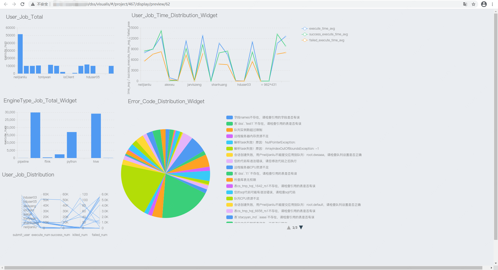
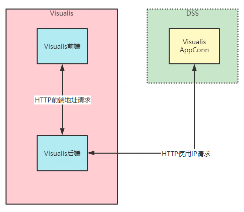

> Visualis Display和Dashboard预览机制

## 1. 简介
&nbsp;&nbsp;&nbsp;&nbsp;Display和Dashboard的预览机制，提供了对将要发送的邮件进行预览的功能。在使用上，可以在开发完成Display和Dashboard后，点击组件上面工具栏中的预览按钮，游览器会新建一个tab并打开预览页面，当页面完全打开后，能看到最终的图片效果。如下图是Display开发完成后最终的预览效果，即最终的邮件报表发送的效果图。


## 2. 设计原理
&nbsp;&nbsp;&nbsp;&nbsp;Visualis后端提供了预览接口，该接口使用场景分为两个，第一个是支持Visualis的前端预览功能，第二个是对接DSS工作流时，Display和Dashboard执行调用的接口。请求值主要是Display和Dashboard的主键ID，其返回值为图片的输出流。

&nbsp;&nbsp;&nbsp;&nbsp;Display预览和Dashboard预览接口较为类似，Dashboard的预览接口可以查看源码中DashboardPreviewController类的previewPortal方法，只是Dashboard的预览存在多个面板页，并对图片进行了聚合，其它逻辑基本相同，Display的预览接口代码：
```java
    @MethodLog
    @GetMapping(value = "/{id}/preview", produces = MediaType.IMAGE_PNG_VALUE)
    @ResponseBody
    public void previewDisplay(@PathVariable Long id,
                                        @RequestParam(required = false) String username,
                                        @CurrentUser User user,
                                        HttpServletRequest request,
                                        HttpServletResponse response) throws IOException {
        Display display = displayMapper.getById(id);
        Project project = projectMapper.getById(display.getProjectId());

        FileInputStream inputStream = null;
        try {
            List<ImageContent> imageFiles = scheduleService.getPreviewImage(user.getId(), "display", id);
            File imageFile = Iterables.getFirst(imageFiles, null).getImageFile();
            if(null != imageFile) {
                inputStream = new FileInputStream(imageFile);
                response.setContentType(MediaType.IMAGE_PNG_VALUE);
                IOUtils.copy(inputStream, response.getOutputStream());
            } else {
                log.error("Execute display failed, because image file is null.");
                response.sendError(504, "Execute display failed, because image file is null.");
            }
        } catch (Exception e) {
            log.error("display preview error: ", e);
        } finally {
            if(null != inputStream) {
                inputStream.close();
            }
        }
    }
```
&nbsp;&nbsp;&nbsp;&nbsp;预览的核心是把Display的页面和Dashboard的页面截图，其主要功能依托于PhantomJS的实现，Visualis使用Java的Selenium库调用PhantomJS进行截图，其核心逻辑在ScreenshotUtil类中实现。截图需要依赖bin目录下的名称为phantomjs的二进制文件，这个是Selenium针对PhantomJS提供的Driver驱动，其相关包可以在Selenium官网上下载。
&nbsp;&nbsp;&nbsp;&nbsp;由于PhantomJS属于不维护状态，未来存在迁移到Chrome的可能性，同样可以在Selenium官网上下载到对应的driver，但使用Chrome需要在Linux机器上安装真正的Chrome浏览器，如需切换为Chromer需要进行适配测试和兼容性测试。

## 3. 预览优化
&nbsp;&nbsp;&nbsp;&nbsp;在实际的生产使用时，偶发场景会出现截图出现空白页的情况，目前
