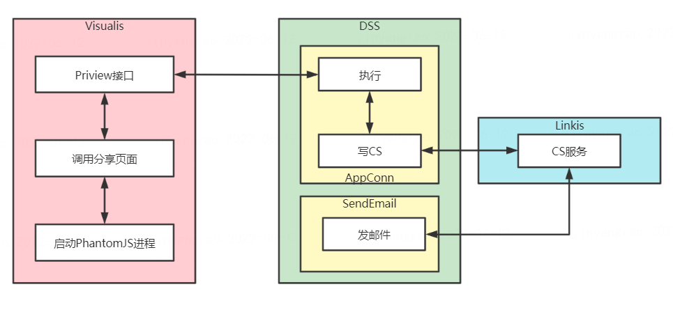

> Visualis 发送邮件设计
## 1. 简介
&nbsp;&nbsp;&nbsp;&nbsp;邮件功能是DSS提供的数据输出功能，其在工作流中可以通过拖拽的方式进行使用。目前邮件节点支持发送Visualis的数据展示节点，即Display节点和Dashboard节点，目前邮件发送采用了图片发送的方式，及配置完成后，在邮箱会收到一张Display和Dashboard的预览效果的图片。在邮件发送中，DSS采用了Spring的邮件发送工具包JavaMailSenderImpl，相关实现在SpringJavaEmailSender类中。


## 2. 邮件发送的实现过程
&nbsp;&nbsp;&nbsp;&nbsp;邮件发送是开发工作流报表的最后一步，在SendEmail节点中，通过链接发送项及绑定发送节点实现数据输出，其功能依赖于Linkis的CS服务。由于邮件节点属于一类AppConn，其也存在相关AppConn的实例，所以在配置邮件发送时，由于邮件需要，需要配置以下邮件配置，其中enhance_json为SendEmail的相关发送配置项，主要为邮件服务器的IP、端口、用户名、密码、协议。其相关配置可以参考如下SQL：
```sql
INSERT INTO dss_appconn_instance (
    appconn_id,
    label,
    url,
    enhance_json,
    homepage_url,
    redirect_url
) VALUES (
    7,
    'DEV',
    'sendemail',
    '{"email.host":"smtp.163.com","email.port":"25","email.username":"xxx@163.com","email.password":"xxxxx","email.protocol":"smtp"}',
    NULL,
    NULL
);
```

&nbsp;&nbsp;&nbsp;&nbsp;邮件发送的过程需要上下有节点相互配合，在SendEmail执行前，数据可视化节点执行时就已经把相关的发送结果准备完成，在DSS工作流侧，Display和Dashboard执行实际上是去请求preview接口，相关实现可以参考[Display Dashboard预览原理]()，使用Linkis的DownloadAction来请求大的结果集（我们默认请求preview的图片是属于大的结果集）。下面是Display和Dashboard的在DSS AppConn执行的核心逻辑。  

```scala
 private ResponseRef executePreview(AsyncExecutionRequestRef ref, String previewUrl, String metaUrl) 
         throws ExternalOperationFailedException {
// 部分代码省略...
HttpResult metaResult = this.ssoRequestOperation.requestWithSSO(ssoUrlBuilderOperationMeta, metadataDownloadAction);
            String metadata = StringUtils.chomp(IOUtils.toString(metadataDownloadAction.getInputStream(),
                              ServerConfiguration.BDP_SERVER_ENCODING().getValue())); // 获得metadataDownloadAction的输出流数据
            ResultSetWriter resultSetWriter = ref.getExecutionRequestRefContext().createPictureResultSetWriter();
            resultSetWriter.addMetaData(new LineMetaData(metadata)); // 写结果集到CS
            resultSetWriter.addRecord(new LineRecord(response)); // 写结果集到CS
            resultSetWriter.flush(); // 刷新流
            IOUtils.closeQuietly(resultSetWriter); // 关闭流
            ref.getExecutionRequestRefContext().sendResultSet(resultSetWriter);
// 部分代码省略...
 }
```

&nbsp;&nbsp;&nbsp;&nbsp;在可视化节点Dispaly和Dashboard执行预览后，其结果集会写入到Linkis的CS服务中，有了需要发送的结果，在SendEmail执行时，只需要从Linkis CS服务中获取相应的内容即可，邮件节点，大概有两块核心逻辑，第一，通过上线文，从工作流的上线文CS中获取各个节点的id，在代码中为NodeIDs数组，然后把该数据进行遍历获取到每个节点任务的id，在代码中为jobIds，相关核心代码如下：

```scala
  def getJobIds(refContext: ExecutionRequestRefContext): Array[Long] = {
    val contextIDStr = ContextServiceUtils.getContextIDStrByMap(refContext.getRuntimeMap)
    val nodeIDs = refContext.getRuntimeMap.get("content") match {
      case string: String => JSONUtils.gson.fromJson(string, classOf[java.util.List[String]])
      case list: java.util.List[String] => list
    }
    if (null == nodeIDs || nodeIDs.length < 1){
      throw new EmailSendFailedException(80003 ,"empty result set is not allowed")
    }
    info(s"From cs to getJob ids $nodeIDs.")
    val jobIds = nodeIDs.map(ContextServiceUtils.getNodeNameByNodeID(contextIDStr, _)).map{ nodeName =>
      val contextKey = new CommonContextKey
      contextKey.setContextScope(ContextScope.PUBLIC)
      contextKey.setContextType(ContextType.DATA)
      contextKey.setKey(CSCommonUtils.NODE_PREFIX + nodeName + CSCommonUtils.JOB_ID)
      LinkisJobDataServiceImpl.getInstance().getLinkisJobData(contextIDStr, SerializeHelper.serializeContextKey(contextKey))
    }.map(_.getJobID).toArray
    if (null == jobIds || jobIds.length < 1){
      throw new EmailSendFailedException(80003 ,"empty result set is not allowed")
    }
    info(s"Job IDs is ${jobIds.toList}.")
    jobIds
  }
```
&nbsp;&nbsp;&nbsp;&nbsp;第二步，由于运行时，其job的任务id在cs服务中对应着运行的结果集路径，通过调用fetchLinkisJobResultSetPaths方法，可以得到任务执行的结果集路径，其结果集路路径，即在任务执行时存入到CS服务中的任务结果记录，获取得到相关结果集后，即可进行邮件发送，邮件发送属于DSS的核心功能之一，是DSS数据输出的功能，在这里对Visualis和DSS报表邮件交互的核心代码进行了描述，其它的相关逻辑需要参考DSS SendEmail代码的相关逻辑。
```scala
  override protected def generateEmailContent(requestRef: ExecutionRequestRef, email: AbstractEmail): Unit = email match {
    case multiContentEmail: MultiContentEmail =>
      val runtimeMap = getRuntimeMap(requestRef)
      val refContext = getExecutionRequestRefContext(requestRef)
      runtimeMap.get("category") match {
        case "node" =>
          val resultSetFactory = ResultSetFactory.getInstance
          EmailCSHelper.getJobIds(refContext).foreach { jobId =>
            refContext.fetchLinkisJobResultSetPaths(jobId).foreach { fsPath =>
              val resultSet = resultSetFactory.getResultSetByPath(fsPath)
              val emailContent = resultSet.resultSetType() match {
                case ResultSetFactory.PICTURE_TYPE => new PictureEmailContent(fsPath)
                case ResultSetFactory.HTML_TYPE => throw new EmailSendFailedException(80003 ,"html result set is not allowed")//new HtmlEmailContent(fsPath)
                case ResultSetFactory.TABLE_TYPE => throw new EmailSendFailedException(80003 ,"table result set is not allowed")//new TableEmailContent(fsPath)
                case ResultSetFactory.TEXT_TYPE => throw new EmailSendFailedException(80003 ,"text result set is not allowed")//new FileEmailContent(fsPath)
              }
              multiContentEmail.addEmailContent(emailContent)
            }
          }
        case "file" => throw new EmailSendFailedException(80003 ,"file content is not allowed") //addContentEmail(c => new FileEmailContent(new FsPath(c)))
        case "text" => throw new EmailSendFailedException(80003 ,"text content is not allowed")//addContentEmail(new TextEmailContent(_))
        case "link" => throw new EmailSendFailedException(80003 ,"link content is not allowed")//addContentEmail(new UrlEmailContent(_))
      }
  }
```