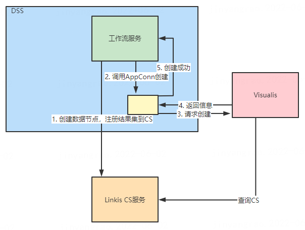

> 工作流-Widget节点绑定DSS结果集节点

## 1. 简介

&nbsp;&nbsp;&nbsp;&nbsp;Visualis作为一个可视化报表系统，目前已与DSS工作流打通，可以通过拖拽的方式来新建Visualis节点，进行可视化开发。对于传统的Visualis使用方式，可视化组件Widget，需要创建一个类似视图的组件View来提供图形渲染的数据源。对于Widget而言，只要是结果集为结构化的数据集，都能作为Widget的数据源进行可视化图形开发。

## 2. 使用方式
&nbsp;&nbsp;&nbsp;&nbsp;如果需要在DSS中使用Visualis的节点，需要参考[Visualis AppConn安装部署文档]()，目前DSS的数据节点，只要能产生结构化数据结果集的节点都能支持与Visualis的Widget节点绑定成功。Widget绑定DSS数据节点的说明可以参考下表：

|节点名|任务类型|备注|
|-----|-----|-----|
|sql|Spark SQL任务|不支持多结果集|
|pyspark|Python Spark任务|见备注|
|hql|Hive SQL任务|不支持多结果集|
&nbsp;&nbsp;&nbsp;&nbsp;对于Sql节点和Hql节点，只要不是多结果集查询，在执行完成后，其产生的结果集会注册到linkis的cs服务中，并生成一个临时表，其Dataframe结果集会注册到服务中，作为临时表存储。**在使用pyspark节点作为上游表时需要注意**，在使用Spark的Python来实现数据查询及作为Widget的数据源时，需要产生一个Dataframe的结果集，并调用show方法，其中Widget会显示为一个df的维度信息，对于表格而言，其属于一个多维度的表格，即列为多个。
```python
df = spark.sql("select * from default.demo")
show(df)
```
&nbsp;&nbsp;&nbsp;&nbsp;如下图为在DSS中使用绑定上游使用Visualis节点的方式。


## 3. 实现原理
&nbsp;&nbsp;&nbsp;&nbsp;在DSS工作流中，拖拽数据开发节点后，其执行后会产生一个类似于cs_tmp_sql_5643_rc1的临时表，当拖拽Widget节点绑定数据开发节点时，在DSS工作流Json中，会设置Widegt节点的Json配置bindViewKey为上游绑定数据开发节点NodeId，DSS后端，会通过该绑定的NodeId找到其CS缓存表，并在请求同步创建Visualis的Widget节点时，传递其CS表对于的CS ID，作为Widget节点所使用的数据源。
&nbsp;&nbsp;&nbsp;&nbsp;下图是在DSS拖拽创建Widget节点时，绑定上游SQL节点所生成的工作流参数JSON。其中bindViewKey即为上游SQL节点的Node ID。
```json
{
  "title": "widget_2919",
  "bindViewKey": "22418bea-caec-4129-93ba-ce1938274b1c",
  "desc": ""
}
```
&nbsp;&nbsp;&nbsp;&nbsp;其创建过程可以如下图所示：


## 3.1. 与DSS对接实现细节
&nbsp;&nbsp;&nbsp;&nbsp;DSS支持Widget、Display和Dashboard节点，它们的CRUD与执行是与Visualis对接的，与DSS对接的实现细节逻辑为如下。
&nbsp;&nbsp;&nbsp;&nbsp;DSS侧需要实现Visualis的AppConn的相关逻辑为：
1. 实现规范中的ProjectCreationOperation，在DSS项目创建时调用。通过HTTP的方式调用Visualis的Controller中的Project创建接口。（根据DSS权限在Visualis原生首页展示Project列表的功能暂未实现）
2. 实现规范中Ref的CRUD相关的Operation接口，在DSS节点创建时调用，通过参数先判断具体需要创建的节点类型，再通过HTTP的方式调用具体的Visualis的Controller中的Widget、Display或Widget创建接口。
  * 其中Widget的创建，并非调用Controller的默认接口，而是专门定义了/widget/smartcreate接口在WidgetResultfulApi中，处理因接入CS和虚拟view改造后需要处理的一些额外的逻辑。另外，Widget本身会保存当前工作流的CSID作为查询上下文信息的依据，所以当CSID本身发生变化的场景，需要调用widget/setcontext接口，更新对应的Widget中记录的CSID，否则会发生找不到上游表的情况。
  * Dashboard在Visualis中实际为多层结构，表现为Dashboard Portal-Dashboard，节点对接的默认创建两层接口，即与节点同名的Dashboard Portal下，只存在一个与节点同名的Dashboard，所以在创建时，需要依次调用两个创建接口，并使它们名称相同，并且是相互关联的。
  * Display在Visualis中实际为两层结构，表现为Display和Display Slide，它们是一对一关系，所以在创建时，需要依次调用两个创建接口，并使它们是相互关联的。
  * 实现规范中的VisualisRefExecutionOperation接口，在DSS节点执行时，通过HTTP的方式调用Visualis中的相应接口获取结果。
  * Widget的执行，调用WidgetResultfulApi中的/visualis/widget/{id}/getdata接口来获取Widget的执行结果。该接口专门为了对接DSS而实现，通过解析Widget的config栏位，模拟前端拼接的查询相关的参数，调用后台查询接口，获取执行结果。Widget执行的结果集，就是它所提交的Spark SQL查询的结果集。
  * Display/Dashboard的查询，调用对应Controller的preview接口，获取对应的截图二进制文件，作为结果集的Record。而结果集的Metadata，是需要再次通过专门的接口来获取，接口定义在WidgetResultfulApi中，接口格式为/widget/{type}/{id}/metadata，其中Display的type是display，Dashboard的type是portal，要注意这里的id，Dashboard要传对应的Dashboard Portal的id。Metadata接口返回的内容是json接口，记录了该Display/Dashboard上所添加的所有Widget的名称与其字段、更新时间的对应关系。
  * 实现规范中的Ref的导入导出的Operation接口，在DSS节点进行导入导出操作时，通过HTTP的方式调用Visualis中的相应接口。
  * ProjectRestfulApi中的import/export接口即为Visualis对导入导出功能的实现。导出接口接收Project ID和对应的widget、display或dashboard的ID作为参数，将所有的信息导出为json结构，上传到BML后，返回resourceId和version。导入接口接收Project ID和BML的resourceId和version作为参数，从BML上下载json结构后，复原成具体的实体，并返回新老ID的对应关系。
 *	需要注意，在AppConn侧，导入成功之后，需要更新原本的JobContent中的id信息，并返回给工作流进行更新。
&nbsp;&nbsp;&nbsp;&nbsp;Visualis侧需要进行以下相关改造：
1. 接入SSO规范。由于Visualis前端与DSS共享用户态，因此只要实现后端接口互相调用时的SSO即可。需要实现VisualisUserInterceptor，用来操作HTTP session中的用户信息。实现VisualisSSOFilterInitializer，用来将DSS提供的SSO Filter加入Visualis的HTTP请求处理的链路中。实现ModifyHttpRequestWrapper，用来将DSS请求提供的cookie信息复制到visualis侧的cookie中。
2. 前端改造。为了支持多环境统一的前端访问，前端页面通过URL捕捉参数env={env}，将参数转换为route label，放入以该页面为起点的后续所有接口请求中，使得gateway能够根据label将请求转发到对应的dev/prod等环境对应的Visualis后台实例中。
