# Visualis使用文档
## 服务入口
Visualis服务目前以DataSphereStudio的一个模块的方式提供，可以进入DSS首页，再按以下步骤进入服务。
支持两种方式使用Visualis服务：
1. 如果需要进行以邮件发送为目的的Display和Dashboard的编辑，或者有项目协作的需求：进入工作空间，通过创建项目进入工作流界面，给予相关人员编辑、查看权限后，再[新建工作流]，进入工作流界面，拖拽Display、Dashboard和Widget节点，保存后，双击节点跳转到对应的编辑页面。

2. 如果无邮件发送需求，则单独在visualis内创建服务：进入工作空间，通过[左上角-全部产品]进入，使用习惯与DSS中保持一致。注意：从这个入口创建的项目和display、dashboard，无法被工作流引用，因此只支持编辑View和Widget。

## 第一个应用
我们先来实现第一个应用，如果某一步不会操作，别担心，你会在后续章节中找到对应的介绍。

1. 登录DataSphereStudio
Visualis服务目前以DataSphereStudio的一个模块的方式提供服务，使用Visualis首先需要登录Visualis。

2. 进入Visualis模块
进入DSS工作空间，通过[左上角-全部产品]进入。点击收藏按钮，在左侧导航栏中点击固定按钮，将visualis固定在dss的上方导航栏，此后直接从上方导航栏进入即可。

3. 创建项目
进入visualis后，点击创建新项目。

4. 创建数据源

5. 创建数据视图

数据视图创建成功之后，开始创建图表组件。

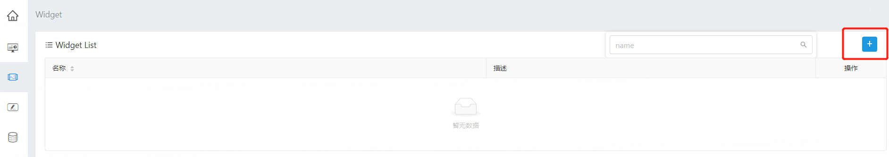

在左上角选择刚才创建的数据视图，加载出数据模型字段列表后，简单地拖拽一个分类型字段至“数据”页签的“维度”，一个“数值型”字段至“数据”页签的“指标”区域，并选择一个图表类型。

保存可视化组件。
6. 创建可视化应用

可视化组件创建成功之后，开始创建可视化应用，点击“创建新 Dashboard”按钮创建仪表板门户。

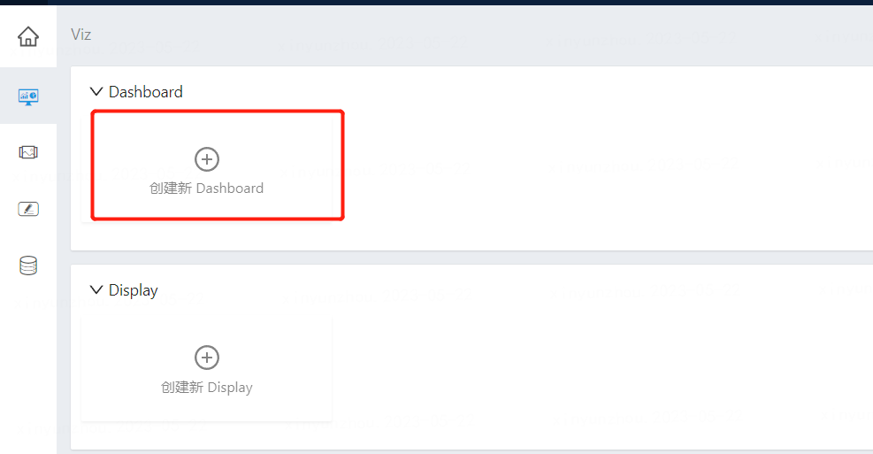

仪表板门户创建成功后，点击进入，在左侧菜单创建仪表板：

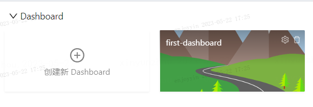

仪表板创建成功后，点击仪表板左上角“+”按钮，将刚才创建的可视化组件添加进来。

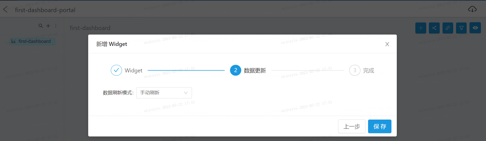

点击保存之后，就能在仪表板上看到刚才创建的可视化组件了。

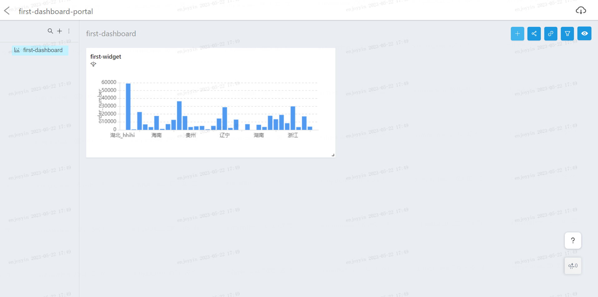

拽住可视化组件右下角稍作尺寸调整，第一个可视化应用就创建成功了！

## 功能概览
### 项目/工程模块
可以通过两种方式创建项目：
1. 在DSS的工作流模块中，创建一个新的项目，Visualis会同步新建一个同名项目。
2. 通过Visualis首页的原生功能创建项目：

### 基本功能模块
1.	View视图:View 是数据的结构化形态，一切逻辑/权限/服务等相关都是从 View 展开。用于管理用户编写的 SQL 模板，和对执行 SQL 后获取到的数据模型以及行列权限进行配置。数据视图的数据从source中获得。
2.	Widget组件:Widget 是数据的可视化形态，一切展示/交互/引导等都是从 Widget 展开。 Widget是可视化应用的最小单元。依据数据视图（View）提供的数据模型对SQL结果进行二次聚合分组，然后将二次加工的数据进行可视化编码。
3.	可视化组件:Visualis提供仪表板Dashboard和大屏Display两个可视化应用组件。仪表板Dashboard: Visualis提供的可视化应用，提供自动布局和可交互能力，帮助用户快速打造可视化报表。Display是 Visualis 提供的第二个可视化应用，通过可视化组件和一系列内置辅助图形来打造视觉呈现丰富的可视化大屏。
## 数据源
1.	Hive数据源，无需手动添加，系统已默认加载。
2.	可以手动添加其它JDBC数据源。
## 视图
### 添加视图
1. 从左侧菜单栏访问视图列表，点击右上角新增按钮：

2. 点击左上角选择一个source，选择相应的数据源（如果是hive数据源，选择hiveDataSource即可）。在编辑框内编写SQL后，点击右下角的Execute接口预执行。
3. 执行完毕后，可在下方的结果集页面预览执行结果。

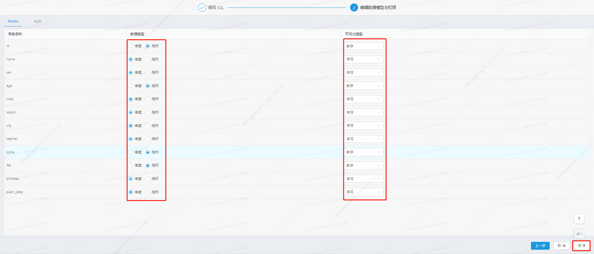

4. 在结果集页面，将tab切换至Model后，可以调整字段类型信息。（如果希望使用中文字段名，可以使用select as语句将字段转换为中文）
5. 完成编辑后，可在左上角为该视图命名后，点击右上角的保存按钮保存该视图。

## 图表组件
### 建立图表
1. 从左侧菜单栏进入Widget组件列表，选择右上方的新增按钮。

2. 进入图表编辑界面。该界面从左到右分别为：视图字段栏、图表配置栏和图表展示区。在左上角选择一个视图后，可以看到视图中的所有字段均在左侧的视图字段栏中被列出。

3. 将字段栏中的字段拖拽进配置栏的指标和维度里，即可实现对图表的编辑和预览。其中，分类型的字段可以被拖入维度中，数值型的字段可以被拖入指标中。如果发现字段的数值型和分类型的划分有误，也可以将字段直接上下拖拽到另一个种类型的栏中，从而直接改变字段的类型。
4. 其中，点击指标后，可以在下拉菜单中切换该指标的聚合方式（默认为sum）。

5. 在展示区预览数据后，可以在配置区切换图表的展现类型。将鼠标悬浮到缩略图标上时，能够看到该图表类型需要满足的指标维度的数量，按照提示调整后，即可完成图表的编辑。
6. 图表展示支持两种驱动模式，a)透视驱动：该模式下，将为每个指标单独生成一张图表；b)图表驱动：该模式下，所有数据均在同一张图表中展示，但数据必须在图表限制的范围内。可以在下图所示区域切换这两种模式。
7. 完成图表编辑后，在左上角输入图表组件名称，点击右上角保存按钮。

### 筛选与排序
1. 支持将任意字段拖拽进配置栏中的筛选框，进行对图表结果的进一步筛选。

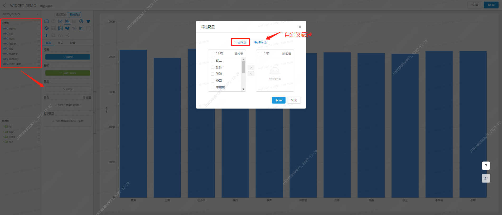

2. 拖拽后，界面将出现一个选择窗口，展现当前字段的所有值。勾选需要的值点击保存。
3. 如果有更复杂的筛选要求，可以切换到条件筛选，定制个性化的筛选。

4. 支持点击维度或指标，进行排序的选择：
5. 注意，当对筛选排序选项进行配置后，必须点击右上角的保存按钮进行保存，否则退出后再次进入，将不会保留上次的配置。
### 图表样式与调整
1. 在一些图表类型中，支持针对每个维度的值使用不同的颜色进行区分显示。如下图所示，将字段拖入颜色框中，在弹出的窗口里，为每个值分配不同的颜色后保存。

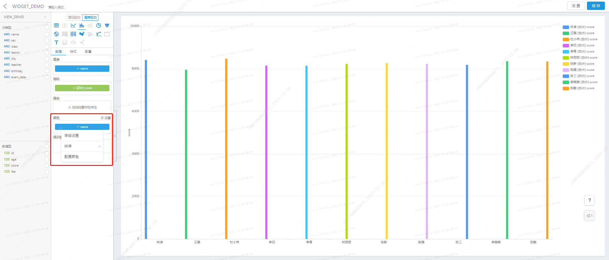

2. 可以通过样式栏，对字体、颜色、标签、坐标轴等元素的外观进行调整，每种图表的可选项均有不同。

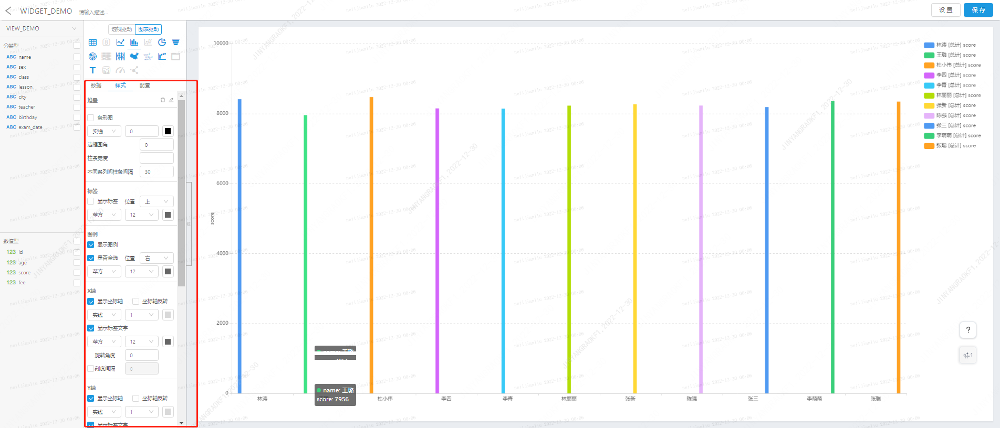

3. 样式的调整也需要通过右上角的保存按钮进行保存。
## 可视化展示
### 两种展示形式
1. Visualis支持DashBoard和Display两种展示形式，可以在左侧菜单栏中选择可视化栏，进入选择界面。

2. 其中，DashBoard的图表以更加有序统一的形式组织在屏幕上，并提供图表联动和全局筛选等高级功能。
3. 而Display的编辑器拥有更高的自由度，支持背景颜色、图层顺序、自定义标签等常用的排版选项，方便定制出更加具有艺术个性的可视化大屏。
### DashBoard
1. 点击添加DashBoard，输入名字后，点击保存，即可在列表中找到刚刚添加的DashBoard。
2. 点击图标进入编辑界面。编辑界面中，支持创建多层的目录结构，以及往目录下添加子DashBoard，以便将DashBoard以不同的逻辑进行分类。

3. 在子DashBoard中，点击右上角的添加图标，即可选择我们之前创建的Widget图表组件，添加到屏幕上来。
4. 第二步中，支持对报表数据的刷新间隔进行配置，默认为手工刷新，可以调整为以秒为单位的自动刷新。
5. 点击保存后，即可看到选中的图表已经被添加到屏幕上。此时，可以通过拖拽来调整图表的大小及位置。
6. 在DashBoard编辑界面的操作都将自动保存，无需额外操作。
### Display
1. 点击添加Display，输入名字后，点击保存，即可在列表中找到刚刚添加的Display。
2. 点击图标进入编辑界面。在右边栏中，支持对整个Display进行一些基础的定制操作。
3. 点击上方菜单栏的图表按钮，即可选择Widget组件进行添加。
4. 点击上方菜单栏的小组件按钮，即可添加一些辅助性的小组件。例如文字标签、当前时间等。
5. 通过拖拽，可以将图表和组件进行位置的调整和放大缩小等操作。如果感到画面太小，可以在画布的右下角调整显示的比例。
6. 直接在画布中点击某个图表，或在右边图层中勾选某个图层（每张图表或小组件都构成一个单独的图层），即可对该图层进行独立的配置。

7. 对于文字标签，可以在右边的配置栏中输入文字。
### 分享与授权
1. 支持将某个DashBoard、某个Display或某个Widget通过链接分享给第三方。注意：打开分享链接时，第三方必须已经登录DSS。

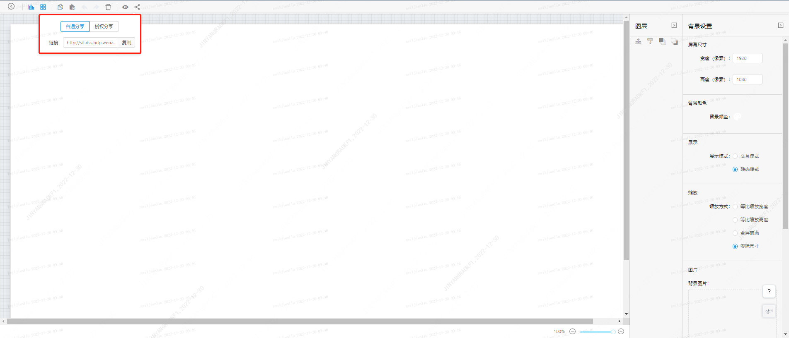

2. 除了普通分享之外，Visualis也支持针对指定用户进行授权分享，只有被授权的用户登录后打开链接才能看到图表内容。

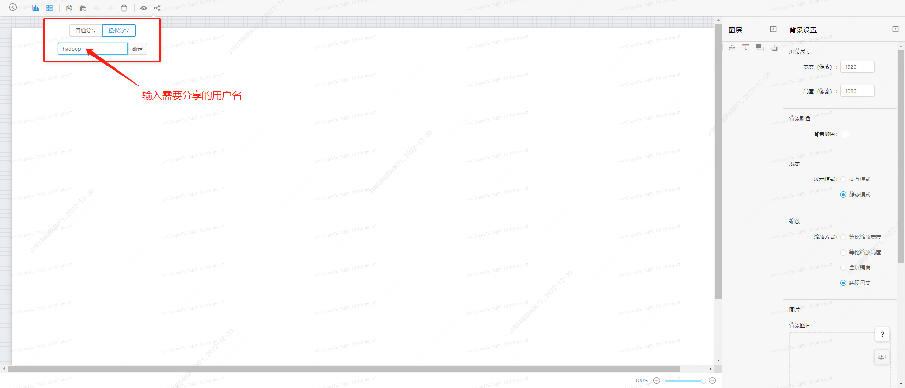