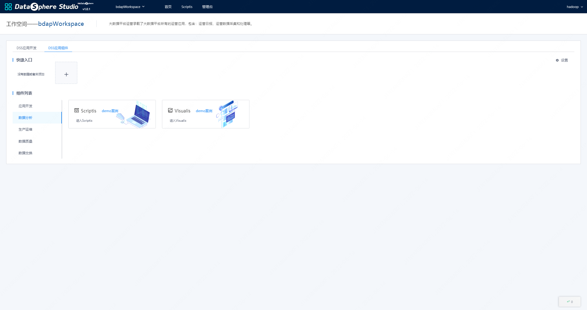
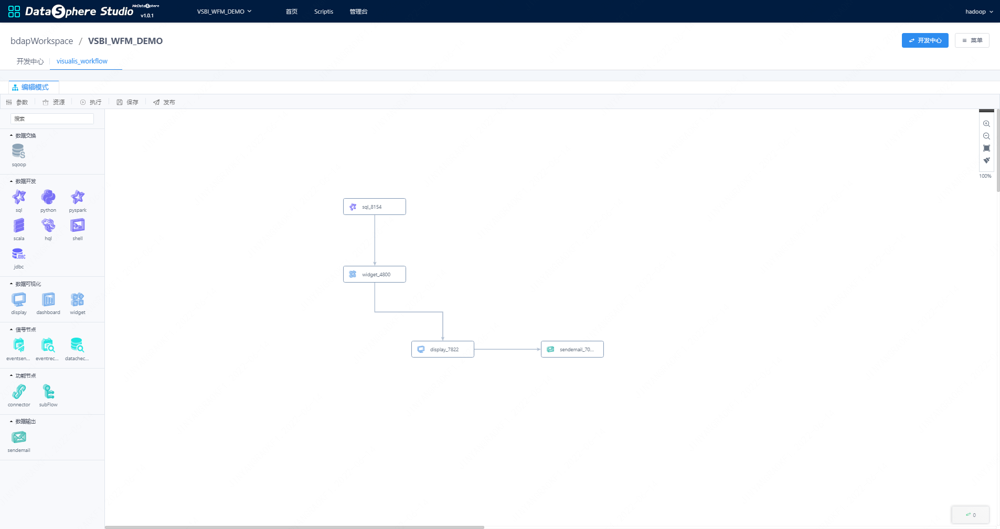

# 1. 功能特性
&nbsp;&nbsp;&nbsp;&nbsp;基于达芬奇项目, Visualis与DataSphere Studio结合，一同实现了以下特性：  
- 图表水印
- 数据质量校验
- 图表展示优化
- 对接Linkis计算中间件
- Scriptis结果集一键可视化
- 外部应用参数支持
- Dashboard/Display集成为DataSphere Studio的工作流节点
- Visualis同时支持以下Davinci的原生功能：数据源
- 支持JDBC数据源
- 支持CSV文件上传
- 数据视图
- 支持定义SQL模版
- 支持SQL高亮显示
- 支持SQL测试
- 支持回写操作
- 可视组件
- 支持预定义图表
- 支持控制器组件
- 支持自由样式
- 交互能力
- 支持可视组件全屏显示
- 支持可视组件本地控制器
- 支持可视组件间过滤联动
- 支持群控控制器可视组件
- 支持可视组件本地高级过滤器
- 支持大数据量展示分页和滑块
- 集成能力
- 支持可视组件CSV下载
- 支持可视组件公共分享
- 支持可视组件授权分享
- 支持仪表板公共分享
- 支持仪表板授权分享
# 2. 与DSS集成
&nbsp;&nbsp;&nbsp;&nbsp;Visualis是一个数据可视化平台解决方案，面向业务人员、数据工程师、数据分析师，及数据相关岗位的，提供一站式数据可视化解决方案。 用户只需在可视化页面前端上，简单配置不同数据源，及可实现一套数据可视化应用，并支持多只数据模型展示，提供高级交互、行业分析、模式探索、社交智能等可视化功能。Visualis与DataSphere Studio的数据开发、工作流调度和数据质量校验等模块无缝衔接，实现数据应用开发全流程的连贯顺滑用户体验。

## 2.1. 应用商店集成
&nbsp;&nbsp;&nbsp;&nbsp;Visualis可以内嵌如DSS前端页面，接入到DSS的应用商店，可以免密互通。

## 2.2. 工作流集成
&nbsp;&nbsp;&nbsp;&nbsp;Visualis实现了DSS的二级和三级规范，接入DSS工程和编排（工作流），配置DSS的工作流节点，支持在DSS工作流中拖拽的方式使用Visualis。

## 3.1. 架构设计
&nbsp;&nbsp;&nbsp;&nbsp;围绕 View（数据视图）与 Widget（可视化组件）两个核心概念设计，View 是数据的结构化形态，一切逻辑/权限/服务等相关都是从 View 展开（在DSS工作流Spark SQL节点作为虚拟View）。Widget 是数据的可视化形态，一切展示/交互/引导等都是从 Widget 展开。下图是Visualis的功能组件模块。

