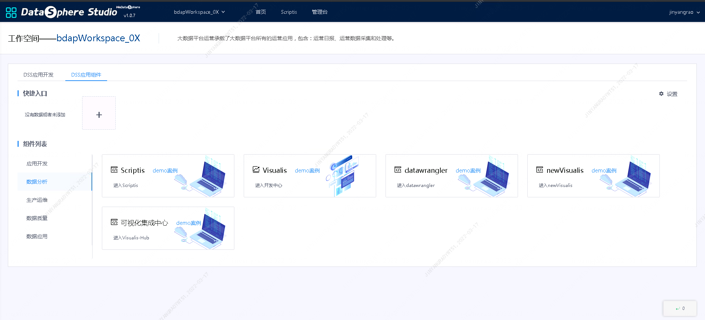
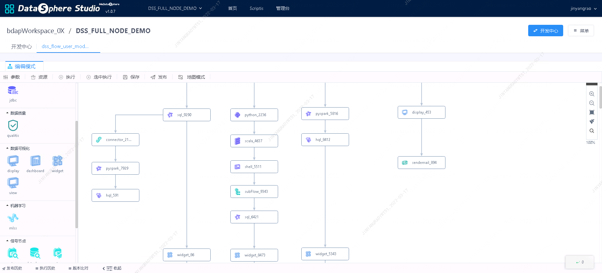
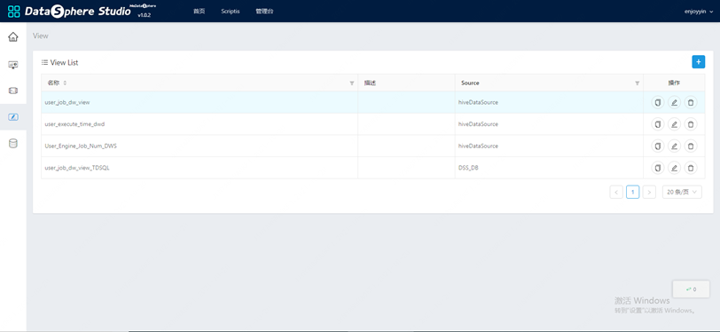
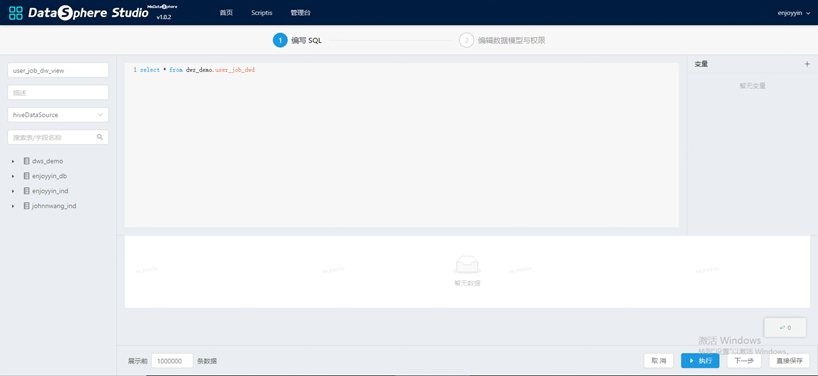
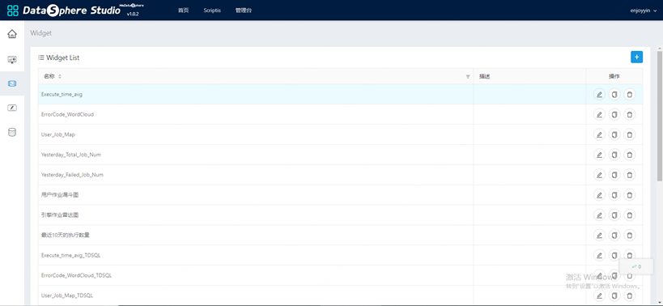
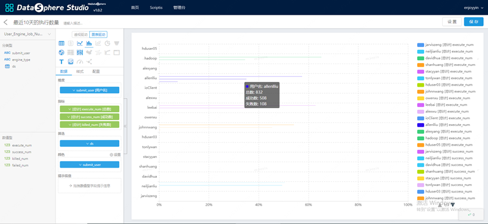
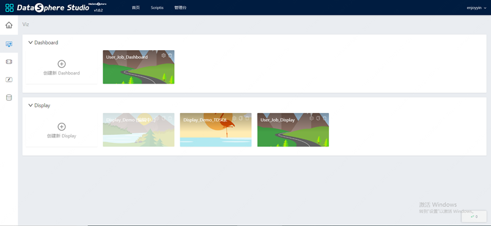

# 1. 使用入口
&nbsp;&nbsp;&nbsp;&nbsp;Visualis服务目前以DataSphereStudio的一个模块的方式提供，可以进入DSS首页，支持两种使用方式。

## 1.1. 工作流使用

&nbsp;&nbsp;&nbsp;&nbsp;拖拽数据可视化节点，即可使用Visualis。

## 1.2. 进入工作空间，通过DSS应用组件-数据分析-进入Visualis使用

&nbsp;&nbsp;&nbsp;&nbsp;注意：从这个入口创建的项目和display、dashboard，无法被工作流引用，因此只支持编辑View和Widget，如果需要进行以邮件发送为目的的Display和Dashboard的编辑，或者有项目协作的需求，请使用第1种访问方式。

# 2. 组件使用介绍
## 2.1. 数据源-Source

&nbsp;&nbsp;&nbsp;&nbsp;Source指连接的数据源，通常在Visualis里面默认有一个Hive的数据源，获取用户在大数据集群中的库表信息，同时用户也可以新增JDBC数据源和CSV文件作为数据源。

## 2.2. 数据模型-View

&nbsp;&nbsp;&nbsp;&nbsp;View可以理解为数据模型，类似于SQL中的视图，通过对数据源进行加工，产生符合业务报表的数据模型。

## 2.3. 可视化组件-Widget

&nbsp;&nbsp;&nbsp;&nbsp;View可以理解为数据模型，类似于SQL中的视图，通过对数据源进行加工，产生符合业务报表的数据模型。

## 2.4. 数据仪表盘-DashBoard

&nbsp;&nbsp;&nbsp;&nbsp;DashBoard的图表以更加有序统一的形式组织在屏幕上，并提供图表联动和全局筛选等高级功能。

## 2.5. 数据大屏-Display
&nbsp;&nbsp;&nbsp;&nbsp;Display的编辑器拥有更高的自由度，支持背景颜色、图层顺序、自定义标签等常用的排版选项，方便定制出更加具有艺术个性的可视化大屏。

# 3. 邮件报表
&nbsp;&nbsp;&nbsp;&nbsp;通过配置DSS工作流邮件节点，选择相关配置，即可发送邮件，发布该邮件报表到WTSS定时调度系统，即可实现报表定时发送功能。

