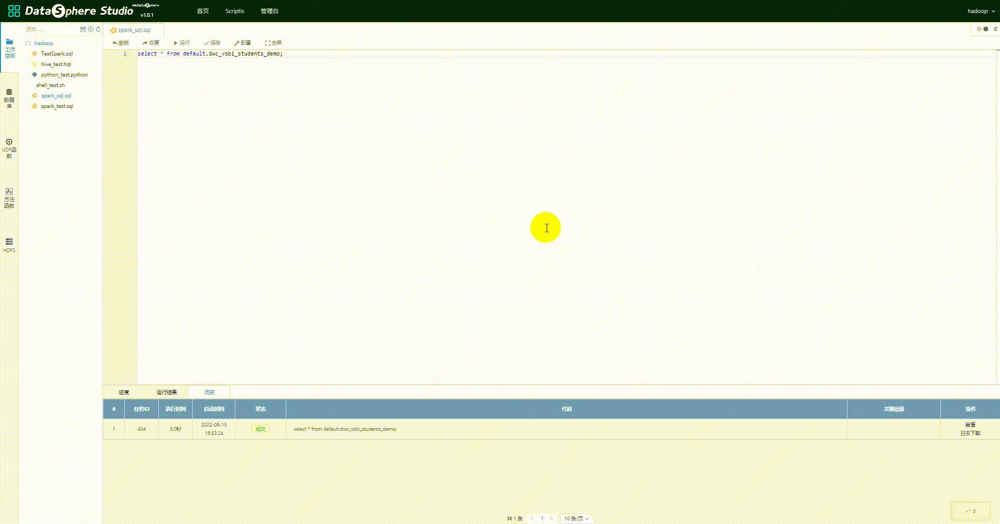
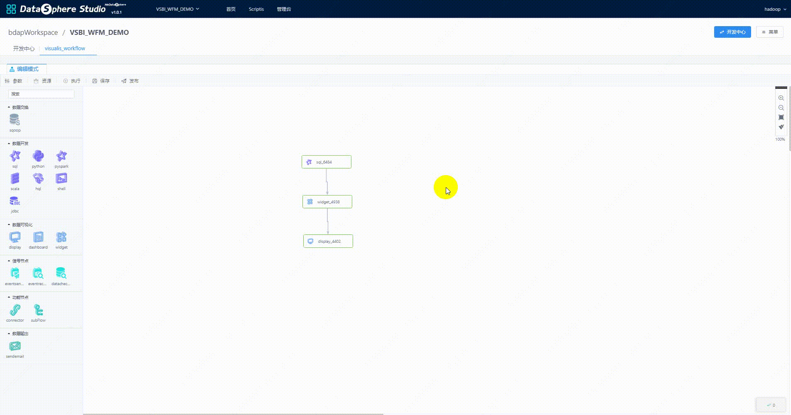

> 使用文档
## 1. 基本使用文档
&nbsp;&nbsp;&nbsp;&nbsp;Visualis是基于Davinci进行开发的数据化BI产品，其支持原有的[Davinci用户用法](https://edp963.github.io/davinci/)，在此基础上，Visualis提供了更多对接DSS的功能点。

## 2. 结果集可视化
&nbsp;&nbsp;&nbsp;&nbsp;Visualis支持对接DSS的交互式脚本分析，在脚本运行完成后，可以对脚本的结果集进行可视化分析，并且结果集会自动绑定到一个默认的Widget，支持简单的拖拽就能实现Widget的开发。

## 3. 工作流使用
&nbsp;&nbsp;&nbsp;&nbsp;Visualis对接了DSS工作流，在DSS侧创建工程时，会同步创建Visualis工程，在工作流中，Widget需要绑定一个上游表，作为数据源，来开发可视化图形，相关实现原理可以参考[Widget节点绑定DSS结果集节点](./Visualis_sql_databind_cn.md)，通过拖拽Widget和Display，Dashboard三个组件，通过连线，即可实现一个可视化报表。

## 4. 邮件使用
&nbsp;&nbsp;&nbsp;&nbsp;DSS提供数据输出节点，在部署安装DSS时，需要配置相关的邮件服务器配置，使用邮件前，需确保邮件服务器的可用性，在工作流中通过拖拽邮件节点，连线并依赖可视化节点，配置相关邮件选项，即可发送邮件，邮件发送的最终效果，可以通过Display和Dashboard的预览接口进行查看。

