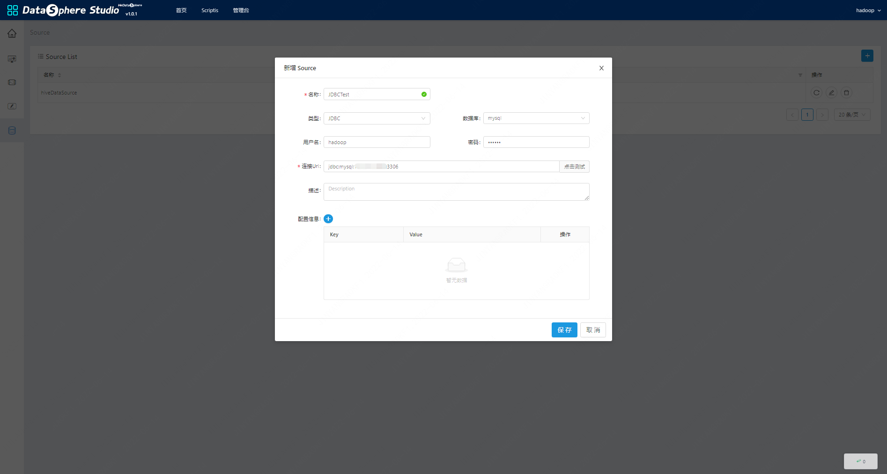
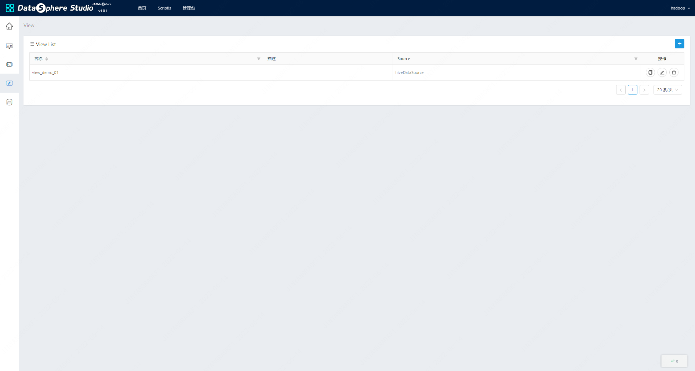
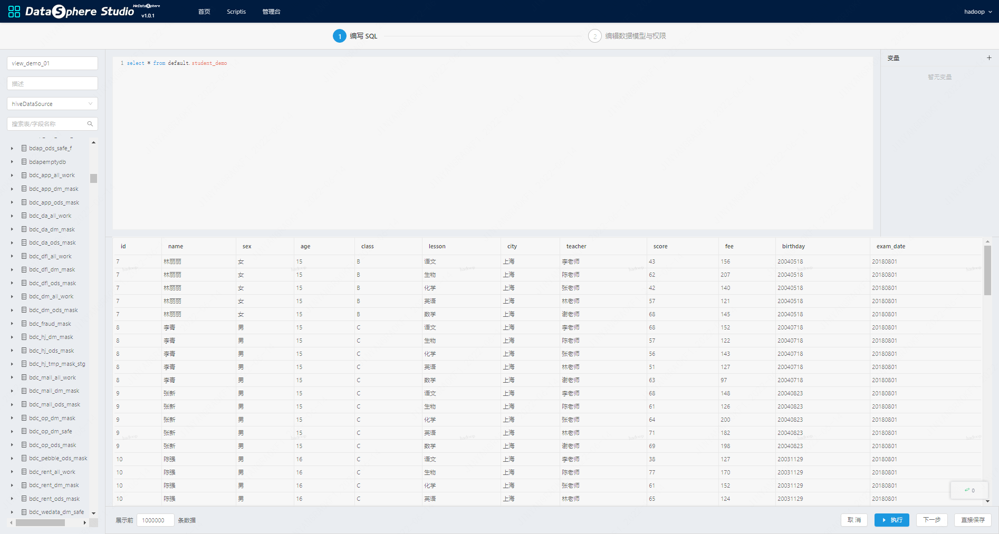
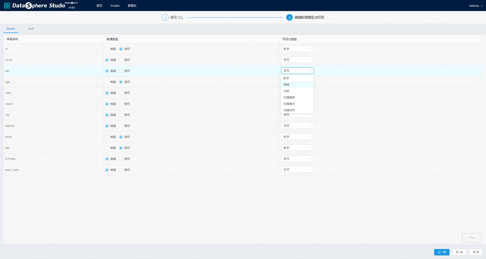
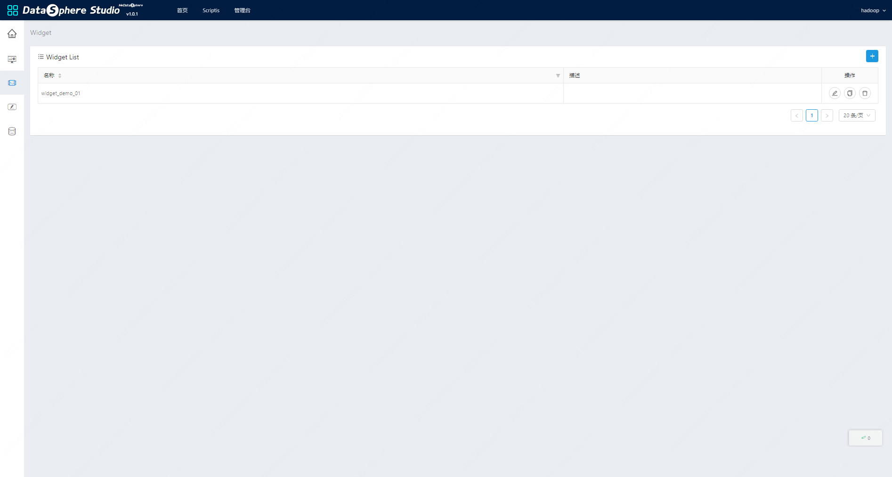
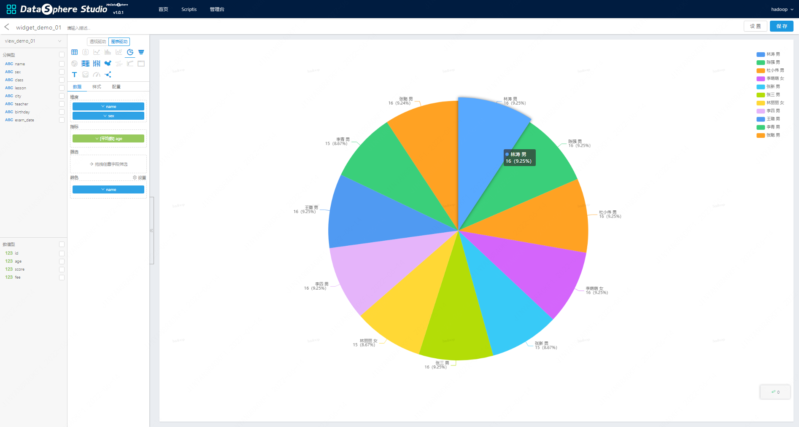
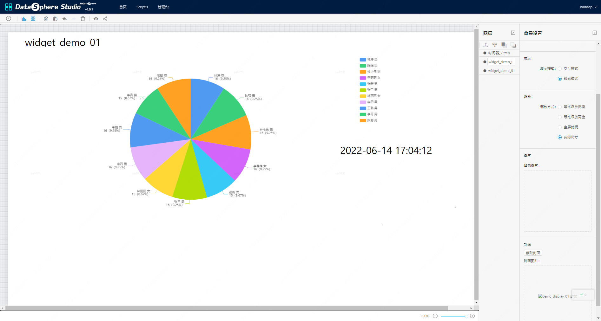
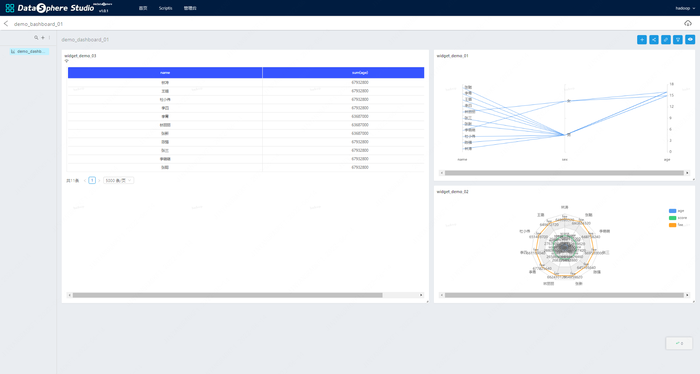
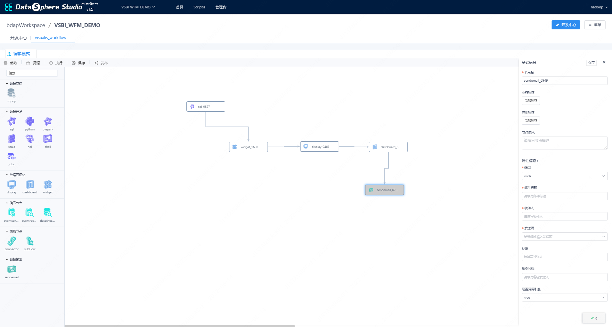

> 使用文档

# 1. 使用入口
## 1.1. 应用商店
&nbsp;&nbsp;&nbsp;&nbsp;应用商店，是访问其外部系统的一种快捷方式，进入工作空间，找到相应的组件入口点击进入即可使用相关组件，需要注意的是，从这个入口创建的项目和display、dashboard，无法被工作流引用，这种方式适合制作数据看板工具。

## 1.2. 工作流使用
&nbsp;&nbsp;&nbsp;&nbsp;Visualis支持与DSS工作流互联互通，DSS和Visualis工程打通，当安装完成Visualis AppConn后，DSS会加载Visualis的相关信息，当DSS创建工程时，Visualis会同步创建同名工程，在DSS工程中拖拽可是化节点（Visualis相关组件），会同步在Visualis创建相关组件，所以在工作流中使用Visualis，只需要拖拽数据可视化节点，即可使用Visualis，目前在工作流中使用最多的是，使用Visualis作为数据的输出工具，制作邮件报表。

# 2. 组件使用介绍
## 2.1. 数据源-Source
&nbsp;&nbsp;&nbsp;&nbsp;Source指连接的数据源，通常在Visualis里面默认有一个Hive的数据源，获取用户在大数据集群中的Hive库表信息，同时用户也可以新增JDBC数据源和CSV文件作为数据源。

## 2.2. 数据模型-View
&nbsp;&nbsp;&nbsp;&nbsp;View可以理解为数据模型，类似于SQL中的视图，通过对数据源进行加工，产生符合业务报表的数据模型。

&nbsp;&nbsp;&nbsp;&nbsp;在View中定义好数据模型后，需要执行，产生各个维度和指标字段，Visualis会自动识别字段类型，并进行默认区分，当然，Visualis支持更加灵活的方式，即系统产生指标维度后，还能由人为自由设置。如下图第一个，当编写完成SQL后，执行完成V，并可以产生结果集，该结果集为Widget所需要引用的数据源。

## 2.3. 可视化组件-Widget
&nbsp;&nbsp;&nbsp;&nbsp;View可以理解为数据模型，类似于SQL中的视图，通过对数据源进行加工，产生符合业务报表的数据模型。

## 2.4. DashBoard和Display
&nbsp;&nbsp;&nbsp;&nbsp;DashBoard的图表以更加有序统一的形式组织在屏幕上，并提供图表联动和全局筛选等高级功能。
&nbsp;&nbsp;&nbsp;&nbsp;Display的编辑器拥有更高的自由度，支持背景颜色、图层顺序、自定义标签等常用的排版选项，方便定制出更加具有艺术个性的可视化大屏。

# 3. 邮件报表
&nbsp;&nbsp;&nbsp;&nbsp;通过配置DSS工作流邮件节点，选择相关配置，即可发送邮件，发布该邮件报表到WTSS定时调度系统，即可实现报表定时发送功能。

